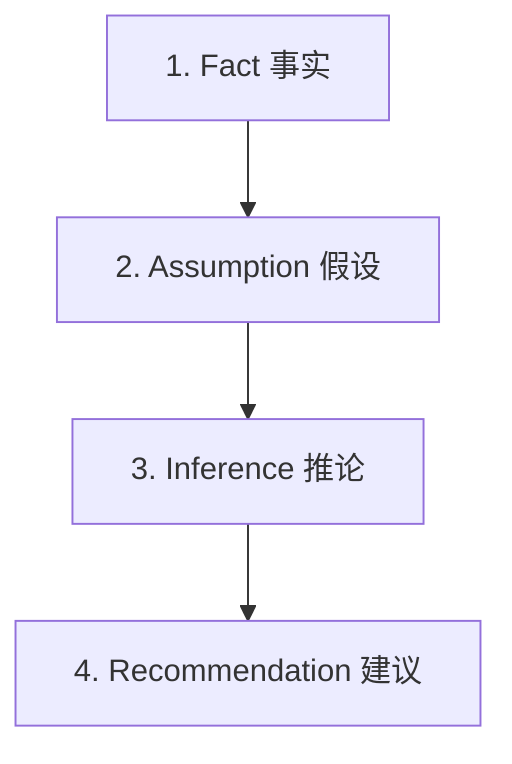

# AI Safety Guardrails (AI 分析十大安全紅線與安全護欄)

本安全規範為 **ABF Capacity Calculator** 的 AI 分析制定了十條不可逾越的**安全紅線**，並設計了 **F-A-I-R 信息分層框架**，旨在杜絕 AI 幻覺、越權決策和財務混淆，確保 AI 分析結果具備“決策級”的安全保障。

---

## 一、AI 分析十大安全紅線

```
🚨 【一票否決制】 🚨
以下十條紅線中，任何一條若在 AI 輸出的報告中被觸碰，
該報告將被立即判定為 Fail，絕對禁止向任何業務人員展示。
```

### 1. 嚴禁擅自篡改計算邏輯 (No Formula Modification)
* **規範**：AI 必須絕對尊重系統底層的物理計算公式。嚴禁自行修改良率調整（Yield Loss）、BU Steps（`max(layerCount/2 - 1, 0)`）以及 Utilization（`Demand/Capacity`）的計算方式。
* **越界示例**：AI 認為“*因為 16 層板非常難做，我擅自將 16 層板的 BU Steps 乘了 1.5 倍以防止產能短缺*”。

### 2. 嚴禁腦補缺失數據 (No Data Inventions)
* **規範**：當系統報警顯示數據缺失（如單價為 0、工廠產能未填寫）時，AI **嚴禁**通過幻覺自行猜測、推估或脑补合理的數值代入營收或產能計算。必須將其作為 Data Quality 缺陷拋出，引導人類進行補齊。
* **越界示例**：AI 發現 SKU-X 價格為 0，報告稱：“*由於該 SKU 未定義單價，我幫大家預估其單價為市場平均價 12 USD，並算出了相應的營收...*”。

### 3. 嚴禁跨幣別直接運算 (No Currency Chaos)
* **規範**：系統必須建立幣別防火牆。所有多幣別（USD, TWD, CNY）原始定價必須在底層折算為標準 USD 後才能相加或計算利用率；在與 BP Target（百萬台幣 Million TWD）對比時，必須展現 `(USD * Rate) / 1,000,000` 的折算路徑。嚴禁不同幣別數值直接加減乘除。
* **越界示例**：AI 報告：“*2026年營收為 100,000 USD，BP目標為 10M TWD。營收超出目標 99,990 元。*”

### 4. 嚴禁將比例歸因解讀為嚴格因果關係 (No Attribution Distortion)
* **規範**：系統的 `bpAttribution` 採用營收比例分攤法（Proportional Attribution），旨在進行資源排序，並非強烈的因果模型。AI 在列出 Gap Drivers 時，必須顯式標註免責聲明，嚴禁引導銷售人員對主力客戶進行無端的商务懲罰。
* **越界示例**：AI 報告：“*AMD 佔據了 2026 年 BP 缺口的 70%，這表明 AMD 惡意違約，我們應立刻對其進行商務制裁。*”

### 5. 嚴禁忽略系統既定假設 (No Assumption Breaches)
* **規範**：AI 必須主動讀取並尊重 Payload 中的 `payload.assumptions`（如工廠固定工作日配置、匯率快照等）。AI 嚴禁在未聲明的前提下，假設這些底層假設是可以無成本隨意修改的。
* **越界示例**：AI 報告：“*我們只要將 8 月份的工作日設置為 45 天，就能完美解決 8 月份的產能短缺。*”（無邊界幻覺）。

### 6. 嚴禁無視數據質量信心評級 (No Confidence Bypassing)
* **規範**：當 `confidenceScore = "low"` 時，AI 必須在報告頂部進行醒目的“低信心警示”，且分析語氣必須全部降級為“邏輯推演”、“僅供參考”。嚴禁在 Low 信心下使用高強度肯定語氣得出確定性業務結論。
* **越界示例**：在 Low 信心下，AI 判定：“*2027年我們 100% 能夠達成業績，建議高管立刻花費 1 億台幣採購新廠房。*”

### 7. 嚴禁發布自動化業務決策命令 (No Automated Business Triggers)
* **規範**：AI 的身份僅限於“决策起草者/輔助者（Drafting / Assisting）”。AI 報告中嚴禁使用“*本 AI 已決定取消...*”、“*請立刻執行採購...*”等命令式或直接修改後台的越權語氣。
* **越界示例**：AI 報告：“*為了消除產能瓶頸，我已經通知系統撤銷了所有低毛利訂單，並向採購部門發送了採購 2 台新機器的指令。*”

### 8. 嚴禁省略人類確認卡點 (No Bypassing Human-in-the-loop)
* **規範**：AI 報告的結尾必須顯式開闢一個“下一步人類驗證清單（Human Verification Checklist）”。AI 必須承認自己無法獲取外部市場環境、供應鏈成本和客戶真實意圖，引導人類專家進行最終卡點。
* **越界示例**：AI 報告直接作為最終發布版導出，不留任何人類確認、核實的接口。

### 9. 嚴禁將分析排序指標與基礎計算混淆 (No Metric Registry Violation)
* **規範**：明確理解 v1.20.0 引入的 `weightedPressureIndex` 只是用於排序 Driver 和 SKU 壓力佔比的分析指標。AI 嚴禁將加權係數（Core 1.3）代入基礎物理需求（Demand）或短缺（Shortage）的公式計算中。
* **越界示例**：AI 報告：“*因為 Core 加權壓力為 1.3，今年實體短缺的面板數自動上調為 1.3 倍。*”

### 10. 嚴禁在敏感性場景中過度承諾 (No Over-commitment in Scenarios)
* **規範**：對 Price Impact 与 Capacity Impact 兩大 Scenarios 的解讀，必須明確其“唯讀假設模擬”屬性，並理性評估其局限性，嚴禁將假設結果當作實體包裝承諾。
* **越界示例**：AI 報告：“*產能模擬顯示提升 10% 可以解決大部分短缺，這意味著我們只要在系統裡按下模擬鍵，工廠的實際產能就已經成功提升了 10%。*”

---

## 二、F-A-I-R 信息分層輸出規範

為了從排版與邏輯上徹底杜絕 AI 將“推論”包裝成“事實”欺騙用戶，AI 生成的報告必須嚴格遵循 **F-A-I-R 信息分層框架**，在報告中將四類信息顯式標註與隔離。



### 1. Fact (事實)
* **定義**：來自 `AnalysisContractPayload` 的決定性、客觀、已發生的數值或系統檢查器拋出的客觀 Bug。
- **標記後綴**：`[Fact / 事實]`
* **示例**：*2026年 8月 Core 面板利用率為 125%，短缺 2,500 panels。 [Fact / 事實]*

### 2. Assumption (假設)
* **定義**：系統運算所依賴的底層邊界參數或臨時啟用的默認配置。
- **標記後綴**：`[Assumption / 假設]`
* **示例**：*本計算基於 TWD 與 USD 匯率快照 1 USD = 32.0 TWD，且工廠默認工作日為 22 天。 [Assumption / 假設]*

### 3. Inference (推論)
* **定義**：AI 基於事實和假設，利用邏輯分析推導出的“可能性”和“潛在因果”，這不屬於 100% 發生的事實。
- **標記後綴**：`[Inference / 推論]`
* **示例**：*由於 8 月份 NVIDIA Forecast 大增 50% 且 Core 利用率高達 125%，推測 8 月的產能短缺主要是由 NVIDIA 訂單激增引起的。 [Inference / 推論]*

### 4. Recommendation (建議)
* **定義**：AI 提供給人類決策者的備選行動方案，必須經過人類商務與實體確認後方可實施。
- **標記後綴**：`[Recommendation / 建議]`
* **示例**：*建議銷售經理在下一步與 NVIDIA 採購團隊核對該筆 Forecast 的準確度，並評估將部分產能調配至 Q4 生產的可行性。 [Recommendation / 建議]*

---

## 三、安全語氣分級指南 (Tone Management)

AI 必須根據系統的 `confidenceScore` 級別，動態調整報告的語氣強度：

| 數據信心級別 | 推薦使用的安全限定詞 (Tone Modifiers) |
| :--- | :--- |
| **High** (高) | “數據明確證實...”、“分析表明...”、“基於完整數據...” |
| **Medium** (中) | “趨勢提示注意...”、“存在局部波動...”、“建議進一步確認...” |
| **Low** (低) | “**僅供參考**”、“**基於不完整數據的假設推導**”、“**極不可信**”、“**嚴禁直接用於實體決策**” |
