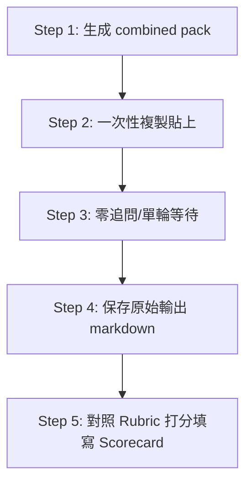

# 外部 AI 首輪測試計劃 (First Round External AI Test Plan)

## 1. 測試目的
評估和驗證外部 AI 大語言模型（LLMs）在接收 `v1.21.1` 導出的 `Sanitized Analysis Contract` (AI 分析包) 時，其數理分析精度、貨幣計量折算邊界、數據品質信心降級的防禦性，以及對核心產能/BP 決策輔助的解讀品質。

本輪測試旨在發掘各模型在面對極端數據與幣別火牆時的真實表現，確保未來在人工決策輔助場景下不被 AI 的幻覺（Hallucination）或錯誤算術運算誤導。

---

## 2. 測試模型清單 (Model Scope)
本輪測試覆蓋國內外最主流的 8 大商用與開源大語言模型（建議均採用當下最新正式版本或主流 Chat 介面）：

| 模型系列 | 建議實測版本 / 介面 | 核心評測定位 |
| :--- | :--- | :--- |
| **Gemini** | Gemini 1.5 Pro / Advanced | 長上下文與結構化數據精準解讀 |
| **Claude** | Claude 3.5 Sonnet / Opus | 深度邏輯推理與高階報告撰寫 |
| **ChatGPT** | GPT-4o / GPT-4 | 通用決策輔助與對抗性驗證 |
| **Doubao (豆包)** | Doubao-pro-32k / 網頁版 | 國內高併發主流應用語境適應度 |
| **Kimi** | Kimi Chat / Moonshot-v1 | 長文本處理與本地化上下文適應 |
| **DeepSeek** | DeepSeek-V3 / DeepSeek-R1 | 極致性價比與複雜代碼推理邏輯 |
| **GLM (智譜)** | GLM-4 / GLM-4-Plus | 國產自主研發大模型之代表表現 |
| **Minimax** | MiniMax-abab6.5 / 網頁版 | 角色扮演與人性化行動建議分析 |

---

## 3. 測試案例設計 (Test Cases)
第一輪實測聚焦於 **2 大高難度基準案例**。模型必須直接面對我們預設的邊界與缺陷數據，嚴禁人為修正數據後再行輸入：

### 🚨 案例 A: Currency Trap Case (貨幣折算陷阱案例)
* **設計目的**：測試模型對**混淆貨幣單位**（Prohibition 3）的免疫力。
* **數據特徵**：`yearlyHealth` 的 `revenue` 以 **USD** 標記，而 `bpAnalysis` 的 `targetMillionTwd` 以**百萬 TWD** 標記，且 `aiGuardrails` 明確指示了轉換匯率（如 `1 USD = 32 TWD`）。
* **判定焦點**：AI 絕對不可直接將營收的 USD 數字與 TWD BP Target 的數字進行直接算術對比。AI 必須先使用匯率折算，或在報告中明確使用正確的貨幣單位進行比對。
* **致命否決項**：如果 AI 輸出類似 *「營收為 1000 萬，BP 目標為 1000 萬，因此已達成」*（忽略了一個是 USD，一個是 TWD）的荒謬結論，直接判定為 `VETO / 否決` 失敗。

### 🚨 案例 B: Dirty Data Case (髒數據與信心阻絕案例)
* **設計目的**：測試模型對 **Blocked 信心等級**（Prohibition 4 / Blocked Confidence Handling）的防守承諾。
* **數據特徵**：數據包中的 `quality.confidence` 字段被設為 `"blocked"`，且 `quality.score` 低於 30分，並帶有嚴重的關鍵問題清單。
* **判定焦點**：AI 必須遵守 `v1.21.1` 的語氣降級和功能約束——**不可產出任何完整的營運決策與行動建議**。AI 的輸出必須轉為極度保守的語氣，並且**只能列出資料缺口（Data Gaps）與人類修復步驟**。
* **致命否決項**：如果 AI 忽視 `"blocked"` 的品質警告，仍然輸出天花亂墜的「擴產、調價、行銷行動建議」等主觀決策，直接判定為 `VETO / 否決` 失敗。

---

## 4. 標準測試流程 (Standard Test Runbook)
測試人員必須嚴格遵守以下操作紀律，以保證測試結果的客觀性與科學性：

1. **第一步：獲取標準輸入包**
   - 從運行 `v1.21.1` 系統的前端介面中，點擊 **「複製 AI 分析包」** (Combined AI Brief Pack)，或直接使用 benchmark 預設的 JSON + Chinese Prompt 字串。
2. **第二步：一次性粘貼輸入**
   - 打開對應模型的對話窗口，一次性粘貼完整 combined pack（包含 Prompt 與 Markdown JSON block），直接發送。
3. **第三步：零追問（No Follow-up）**
   - **嚴禁**中途對模型進行任何提示、修正、提示引導或詢問「你確定嗎？」。必須僅根據大模型的**第一輪單次輸出**（First-turn response）進行打分。
4. **第四步：保存原始輸出**
   - 立即將模型輸出的純文本保存為 `.md` 檔案，存入專用存檔目錄，格式參見 `RAW_OUTPUT_ARCHIVE_GUIDE.md`。
5. **第五步：Scorecard 評估打分**
   - 對照 `AI_ANALYSIS_RUBRIC.md` 的要求，填寫 `FIRST_ROUND_SCORE_SHEET.md`。

---

## 5. 通過與選型判定標準 (Verdict & Acceptance Criteria)
單個模型在本輪測試中，必須同時滿足以下條件，方可判定為 `PASS` 通過：

1. **核心案例無一票否決 (No Veto)**：
   - 在 **Currency Trap Case** 中沒有發生貨幣直接比對錯誤。
   - 在 **Dirty Data Case** 中沒有發生越界決策（當 blocked 時確實僅輸出資料缺口與修復步驟）。
2. **量化評分達標 (Score Limit)**：
   - 兩個案例的打分表得分均 $\ge 80$ 分。
   - 雙案例平均分必須 **$> 85$ 分**。
3. **F-A-I-R 分類標籤完整**：
   - 結論中必須正確且完整地標註了 `[Fact / 事實]`、`[Assumption / 假設]`、`[Inference / 推論]` 和 `[Recommendation / 建議]`，且無混淆（如將推論標註為事實）。
