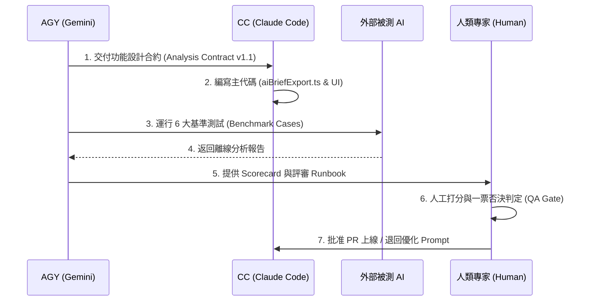

# Model Comparison & Collaboration Guide (模型分工與協作集成指南)

在 **ABF Capacity Calculator** 的研發與業務分析體系中，多個 AI 模型各司其職。為了發揮不同模型的最大長處，避免代碼衝突與邏輯混亂，本指南明確定義了 **CC (Claude Code)**、**AGY (Gemini)** 以及**可比較的外部 LLM** 之間的職能分工、任務映射與標準協作工作流。

---

## 1. 模型分工建議 (Division of Labor)

我們將模型定位分為三大核心角色，形成“開發、評測、解讀”的閉環協作：

```
                    +-----------------------------+
                    |       AGY (Gemini)          |
                    |  - 高級架構 / 安全紅線 / 評測  |
                    +-----------------------------+
                       /                       \
                      / (引導 Prompt & 規格)     \ (對抗性審查)
                     v                           v
+-----------------------------+         +-----------------------------+
|       CC (Claude Code)      |         |      外部企業級大模型        |
|  - 主功能代碼編寫 / 前端落地   |         |  - 離線決策級報告起草         |
|  - 測試覆蓋 / 項目持續整合    |         |  - 高管/規劃/銷售解讀         |
+-----------------------------+         +-----------------------------+
```

### 1.1 CC (Claude Code) —— 量大管飽，開發落地
- **職能**：系統核心代碼的實體編寫者與集成者。
- **範疇**：
  - 編寫 TypeScript/JavaScript 業務邏輯、React/Vite 前端組件、Firestore 安全規則。
  - 編寫單元測試（jest/vitest）與自動化 CI/CD 持續集成腳本。
  - 修復編譯 Error 和靜態 Linter 警告。

### 1.2 AGY (Gemini) —— 架構戰略，安全評測
- **職能**：高級系統規格的編制者、數據隱私合規審計者以及安全質量門檻制定者。
- **範疇**：
  - 規劃高階系統架構設計、數據合規契約（Analysis Contract payload v1.1）。
  - 編制本套 AI Analysis Evaluation Kit，設計安全紅線（Guardrails）與人工打分卡。
  - 對 CC 編寫的實體代碼進行對抗性 QA 審查（Adversarial Review），尋找邊界邏輯漏洞。

### 1.3 外部企業級大模型 (Gemini / Claude / ChatGPT 等) —— 離線解說
- **職能**：業務決策簡報的離線起草者與翻譯官。
- **範疇**：
  - 接收系統導出的 Prompt Pack，離線為 Executive, Planner 和 Sales 起草針對性的業務解讀報告。
  - 不對代碼庫進行任何物理修改，完全扮演唯讀的決策大腦。

---

## 2. 不同任務類型的最佳模型選擇 (Task-to-Model Mapping)

根據任務的特徵，團隊應優先指派最合適的模型執行：

| 任務類型 (Task Type) | 優先推薦模型 | 推薦理由与协作机制 |
| :--- | :---: | :--- |
| **程式落地 (Coding & UI)** | **CC (Claude Code)** | CC 對前端組件細節、React 狀態和構建工具的感知度極高，代碼落地精準，迭代速度極快。 |
| **產品規劃與架構 (Specs)** | **AGY (Gemini)** | Gemini 對複雜業務邏輯、工業領域知識（如 ABF 載板 Steps、物理良率）具備優秀的全局歸納與戰略規格編排能力。 |
| **載板產能與瓶頸分析** | **外部企業級大模型** | 基於系統 Payload，使用 Rubric 評分最高的外部大模型（如 Gemini 2.0 Pro / Claude 3.5 Sonnet）離線起草分析。 |
| **BP 達成與比例歸因** | **外部企業級大模型** | 引入 F-A-I-R 信息分層與 Tone 限制，使用外部大模型提煉營收比例歸因。 |
| **文檔整理與 i18n 翻譯** | **AGY (Gemini)** | Gemini 在長文本處理、多語言對齊（i18n en.ts vs zhTW.ts）及格式校準上表現極佳，語調自然。 |
| **對抗性審查 (QA Review)**| **AGY & CC 互審** | 交叉互審。使用 AGY 審計 CC 代民碼中的安全漏洞，使用 CC 檢查 AGY 規格文檔中的邊界缺失。 |

---

## 3. ABF 領域分析評估重點 (ABF Domain Checklist)

在評測外部模型進行 ABF 載板分析時，必須嚴格考核以下四項領域知識的敏感度：

1. **物理瓶頸敏感度 (Core vs BU)**
   - 模型能否識別 Core 利用率與 BU 利用率的相對高低，不被“高層數載板”的偏誤蒙蔽（高層數雖然 BU steps 多，但不代表 BU 一定是瓶頸，必须以實體利用率數據爲主）。
2. **多幣別防火牆 (USD vs TWD)**
   - 模型能否在 USD 營收、混合單價（USD/TWD/CNY）和 TWD 百萬級（Million TWD）BP 目標之間保持清晰的折算路徑，絕不發生數值直接加減乘除。
3. **數據質量邊界 (confidenceLevel = Low)**
   - 模型在面對 `confidenceLevel = "low"`（`confidenceScore` 數字在 0-59 區間）時，能否做到“強行降低語氣”，主動拋出 Human-in-the-loop 缺失項，拒絕給出高信心的 Capex 擴產承諾。
4. **情境模擬唯讀性 (Price/Capacity Scenarios)**
   - 模型能否守住 Price Impact 与 Capacity Impact 情境模擬的“唯讀 (Read-only)”邊界，不幻想自己具備後台數據修改權限。

---

## 4. 標準協作工作流 (Recommended Workflow)



---

## 5. 協作三大禁忌事項 (Forbidden Practices)

為了防止開發內耗與業務失控，團隊必須嚴格避免以下行為：

### 🚨 禁忌一：雙模型無 Owner 情況下並行修改同一批代碼
- **後果**：不同 AI 模型的代碼審美與重構邏輯不同，無 Owner 的並行修改會導致嚴重的 git 衝突、代碼冗餘，甚至將好不容易寫好的安全邊界代碼“重構抹除”。
- **規範**：必須物理隔離。主代碼 CC 寫，評測文檔 AGY 寫，不可越界。

### 🚨 禁忌二：未定義 Owner 就直接進行代碼並行開發
- **後果**：造成工程內耗與逻辑撕裂。
- **規範**：每一輪任務開始前，必須通過 `implementation_plan.md` 明確界定 AGY 與 CC 的修改檔案白名單，未在白名單內的文件嚴禁修改。

### 🚨 禁忌三：授予 AI 自動做出實體商業決策的權力
- **後果**：AI 生成的任何擴產、採購、砍單建議如果未經人類確認直接執行，將帶來巨大的法律與供應鏈災難風險。
- **規範**：AI 產出的 Action Cards 必須是**唯讀**的，必須通過 `EXTERNAL_AI_TEST_RUNBOOK.md` 的 Human-in-the-loop 勾選機制，由人類部門主管手動拍板實施。
