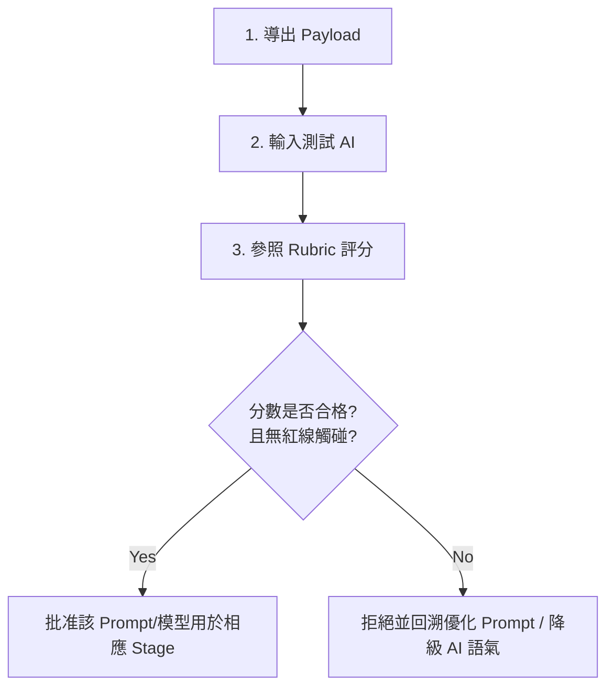

# ABF Capacity Calculator - AI Analysis Evaluation Kit

本評測規格包（AI Analysis Evaluation Kit）是一套**非侵入式、離線的 AI 分析品質評估體系**。

旨在為 **ABF Capacity Calculator** 的結構化數據輸出（`AnalysisContractPayload`）提供嚴格的 AI 分析品質檢驗標準、測試用例與安全規範，以評估外部大語言模型（如 Gemini, Claude, ChatGPT 等）對載板產能與商業計劃（BP）分析的決策級可信度。

---

## 1. 背景與定位

### 1.1 背景
**ABF Capacity Calculator** 在 v1.20.0 之後提供了高度結構化、決定性的決策分析基礎數據，包括：
- **物理產能指標**：Core/BU 面板需求量、工廠產能、利用率、短缺月份及 SKU 驅動因子。
- **商業計劃指標**：BP 達成率、BP Gap 以及基於營收比例的**比例歸因（Proportional Attribution）**。
- **情境模擬（Scenarios）**：價格變動（±5%/±10%）敏感度與產能提升（+10%）的唯讀情境模擬。
- **數據質量矩陣（DQ）**：包含 Error, Warning, Info 的三級數據質量檢查。

為了將這些乾燥、客觀的數據轉化為高管、規劃經理、銷售協作人員可以直接閱讀的決策簡報，引入 AI 進行輔助分析是必然趋势。然而，大語言模型（LLM）天生存在幻覺（Hallucination）、公式越界、幣別混淆、因果關係倒置等高風險行為。

### 1.2 定位：離線評測規格包
本評測規格包是一個**純文檔、非侵入式的評估框架**：
- **不接入 AI API**：系統不與任何外部 LLM 建立即時 API 連線，確保資訊安全與隱私。
- **不修改產品代碼**：本規格包所有文件均位於 `docs/ai-eval/` 下，不對 `frontend/src` 中的計算邏輯、Firestore 或 UI 進行任何實體修改。
- **不部署**：本模組為離線評審與測試指南，不作為線上服務發佈。

---

## 2. 使用場景 (Use Cases)

本評測規格包主要服務於以下三大核心場景：

1. **AI 服務選型與基準測試 (Benchmarking)**
   - 當需要評估 Gemini 1.5 Pro/2.0、Claude 3.5 Sonnet 或 GPT-4o 哪一個更適合做為我們未來的 AI 分析助手時，使用 `AI_ANALYSIS_BENCHMARK_CASES.md` 中的 6 大標準案例進行盲測，並根據 `AI_ANALYSIS_RUBRIC.md` 的量化指標打分。
2. **Prompt 工程調優 (Prompt Engineering & Optimization)**
   - 產品開發人員（CC 等）在設計系統內建的 AI Brief Export/Prompt Pack 時，可參照本規格包中的 `AI_SAFETY_GUARDRAILS.md`（安全紅線）和 `AI_OUTPUT_TEMPLATES.md`（輸出模板），將其作為 Prompt 的 System Prompt 或 Constraints 進行強化，並使用 Rubric 檢驗導出效果。
3. **人工審閱與品質卡點 (Human-in-the-loop Quality Control)**
   - 在 Stage A（外部輔助分析）階段，規劃人員將 Payload 複製到外部 AI 分析後，主管或評審人員可以使用 `AI_ANALYSIS_RUBRIC.md` 作為核對清單，快速判斷 AI 產出的報告是否達到“決策級（Decision-Grade）”要求，是否觸碰安全紅線。

---

## 3. 文件清單 (Document Registry)

本規格包由以下 6 份核心文件組成，各司其職：

| 文件名稱 | 核心定位 | 解决的痛點 |
| :--- | :--- | :--- |
| **[README.md](file:///D:/abf-capacity-calculator-agy/docs/ai-eval/README.md)** | 入口導航與背景說明 | 釐清評測包的邊界與定位，防止開發範圍蔓延。 |
| **[AI_ANALYSIS_RUBRIC.md](file:///D:/abf-capacity-calculator-agy/docs/ai-eval/AI_ANALYSIS_RUBRIC.md)** | 100分制評分標準與規準 | 解決 AI 評估“好壞難分”的模糊性，將產能與 BP 判讀量化。 |
| **[AI_ANALYSIS_BENCHMARK_CASES.md](file:///D:/abf-capacity-calculator-agy/docs/ai-eval/AI_ANALYSIS_BENCHMARK_CASES.md)** | 6 大工業級測試案例規格 | 提供涵蓋短缺、髒數據、幣別陷阱等真實 ABF 邊界測試場景。 |
| **[AI_OUTPUT_TEMPLATES.md](file:///D:/abf-capacity-calculator-agy/docs/ai-eval/AI_OUTPUT_TEMPLATES.md)** | 三大角色回覆模板 | 規範 AI 面對高管、規劃經理、銷售等不同受眾時的語氣與必填項。 |
| **[AI_SAFETY_GUARDRAILS.md](file:///D:/abf-capacity-calculator-agy/docs/ai-eval/AI_SAFETY_GUARDRAILS.md)** | 十大安全紅線與信息分層 | 強制 AI 遵守公式邊界、標識不確定性，將推論與事實嚴格區分。 |
| **[NEXT_AI_ROADMAP.md](file:///D:/abf-capacity-calculator-agy/docs/ai-eval/NEXT_AI_ROADMAP.md)** | 前瞻性 AI 演進三階段規劃 | 為未來的 API 集成、隱私治理、決策協同指明漸進式路線圖。 |

---

## 4. 評估使用流程 (Evaluation Workflow)

當你要評估一個 AI 模型或一組 Prompt 組合的分析質量時，請遵循以下 5 步標準流程：

1. **數據導出**：從 ABF Capacity Calculator 系統中導出標準的 `AnalysisContractPayload`（包含完整的 SKU 矩陣、月度產能統計、DQ 警告與敏感性模擬數據）。
2. **基準輸入**：將上述結構化數據，配合 `AI_OUTPUT_TEMPLATES.md` 規定的角色 Prompt，輸入被評測的 AI（如 Gemini 2.0 Pro）。
3. **基準測試**：交替輸入 `AI_ANALYSIS_BENCHMARK_CASES.md` 中指定的各類極端案例（如 Currency Trap Case、Dirty Data Case），測試其抗干擾與異常識別能力。
4. **量化打分**：評估小組依據 `AI_ANALYSIS_RUBRIC.md` 的 8 大維度進行 100 分制打分，並逐條核對 `AI_SAFETY_GUARDRAILS.md` 中的 10 大安全紅線。
5. **判定與調整**：
   - **合格標準**：總分 $\ge 85$ 分，且**完全未觸碰任何安全紅線**（一票否決制）。
   - 如果不合格，必須回溯調整 System Prompt 限制，或在輸出端增加人工強制過濾機制。

---

## 5. 不適用範圍 (Out of Scope)

本評測規格包**嚴格不適用**於以下範疇：
- **自動化執行建議**：AI 給出的任何“擴產”、“採購設備”、“對客戶砍單”等行動建議，本規格包將其定位為“僅供人類確認的備選推論”，**嚴禁**將其直接作為系統可執行的自動化指令（Automated Trigger）。
- **財務審計依據**：本系統的營收預估和 BP attaintment 歸因屬於 Proportional Attribution（比例歸因），是用於資源排序與方向判斷的“決策輔助”，**不能**用於正式的財務會計審計。
- **線上即時數據寫回**：本規格包所評估的 AI 產出均為唯讀簡報與建議，**不可**繞過人工作為新 Forecast 或新 Capacity 參數寫入 Firestore 資料庫。
