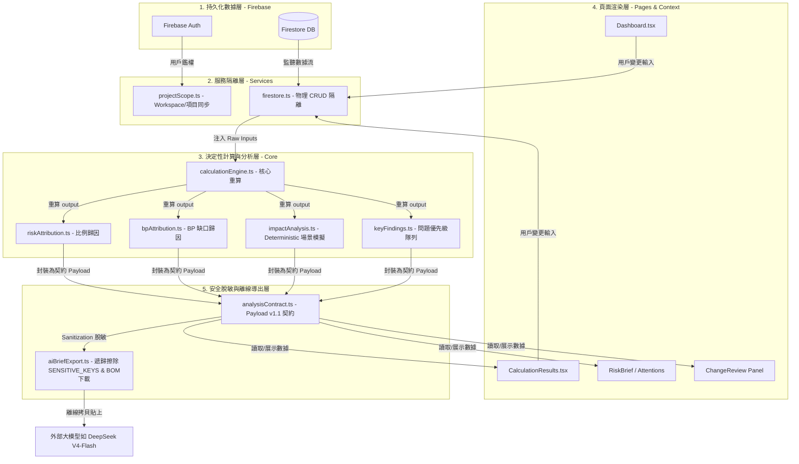

# ABF Capacity Calculator 代碼實作架構審查書 (ARCHITECTURE_REVIEW.md)

本文件對專案的代碼架構、數據流、模組職責邊界、現有架構缺口進行前瞻性評估，並製定強力的架構紅線（Guardrails），引導 CC 未來安全實作 Phase 6 快照版本對決。

---

## 1. 系統數據流全景拓撲圖 (Architecture Dataflow)

系統採用 Serverless Firebase 作為持久化層，前端以 Service Layer、Core Calculation Layer、Pages Render Layer 及 Sanitized Data Contract Layer 進行清晰解耦：

---

## 2. 核心模組責任邊界評估 (Module Responsibility Spec)

為了避免代碼隨意重構導致職責不清，我們將現有 codebase 的 5 大模組職責硬性界定如下：

### 2.1 Core Calculation Layer (`frontend/src/core/`)
* **職責邊界**：僅負責產能、利用率、缺口、歸因、敏感度等純數學、決定性的算術運算。
* **物理邊界**：**絕對不可**引入任何 Firebase/Firestore SDK，不可調用任何 UI 狀態（如 React hooks、context），必須保持無狀態、可測試、決定性。
* **評估**：現有 `calculationEngine.ts` 等模組職責極其清晰，與 UI 隔離完備，單元測試覆蓋度高，優勢顯著。

### 2.2 Service Layer (`frontend/src/services/`)
* **職責邊界**：僅負責與 Firebase/Firestore 實體數據庫進行 CRUD 通訊，以及 Workspace 共享關係的同步。
* **物理邊界**：**絕對不可**參與 core 核心物理算術的推演，不可含有任何 UI 風格（AntD）組件。
* **評估**：`projectScope.ts` 與 `firestore.ts` 完美隔離了 Firebase 通訊，保障了數據層的獨立性。

### 2.3 Presentation Layer (`frontend/src/pages/` & `components/`)
* **職責邊界**：僅負責調用 context 數據，並使用 Ant Design 組件渲染用戶介面。
* **物理邊界**：**絕對不可**繞過 `services/` 直接讀寫 Firestore，亦不可在 Page 組件中重寫 core 計算公式。 Page 組件應只讀取數據契約 Payload 進行純淨渲染。
* **評估**：`CalculationResults.tsx` 仍然偏大，承擔了較多的 i18n 展示責任。建議未來將其內置的 Attributions 渲染抽離為獨立子組件（Components），降低組件複雜度。

### 2.4 i18n Strategy (`frontend/src/i18n/`)
* **職責邊界**：負責全局中英文翻譯。
* **物理邊界**：通過 `i18nOutputs.test.ts` 確保 key parachute，禁止出現翻譯死角。
* **評估**：機制的嚴密性極佳，保證了多語言的鏡像對齊。

### 2.5 Docs/Evaluation (`docs/` & `docs/ai-eval/`)
* **職責邊界**：負責對外部 AI 評測建立離線測試案例、評分卡與 Rubric。
* **物理邊界**：純旁路技術文檔，不干涉產品代碼編譯。

---

## 3. 現有架構缺口與 Guardrails (Architecture Guardrails)

### 3.1 現有架構缺口：
- **歷史快照漂移隱患 (Drift Gap)**：現有架構在保存版本快照時，如果採用僅保存 raw inputs 方案，在未來物理公式微調時，歷史快照的重新計算結果會發生漂移，破壞「歷史時間膠囊」的不可篡改性。
- **Firestore 文檔 1MB 物理超限風險**：如果快照沒有體積控制，大數據量下保存將直接失敗。

### 3.2 🌟 6 大強硬架構紅線 (Architecture Guardrails v2)：
為了防止代碼退化，CC 與 AGY 在後續開發中必須嚴格遵守以下架構守護規則：

1. **Firestore 隔離原則**：`core/` 下的任何文件，一律禁止 `import { ... } from 'firebase/firestore'`。
2. **Immutable 快照防護**：快照數據路徑（如 `snapshots/{snapshotId}`）寫入後，Firestore rule 必須強行限制為：`allow update: if false;`，保證快照 Immutable。
3. **無 AI 侵入原則**：前端正式代碼中，禁止 `import` 任何外部 AI API 實體 SDK，大盤分析保持 100% 決定性本地化。
4. **混合快照體積控制**：快照採用 `rawInputs` + `derivedHighlights` 混合結構，快照文檔大小必須小於 100KB。
5. **UI 零算術原則**：任何 `Page` 或 `Component` 中，禁止出現自定義的 utilization/shortage/attatinment 數學計算公式，所有數據必須從 `AnalysisContractPayload` 中唯讀拉取。
6. **BOM 離線釋放閉環**：任何下載離線包的 URL 生命週期，onClick 結束後必須強制調用 `revokeDownloadUrl`，嚴防內存洩漏。

---

## 4. 對 v1.22 Snapshot & Change Impact 的架構評價

我們對即將到來的 Phase 6 (v1.22.0) 「預測版本控制與變更影響對決」方案給予高度實戰評價：

### 🟢 方案優點：
- **極大優化了歷史不可篡改性**：推薦採用的 **Derived Highlights 靜態鎖定技術**，徹底解決了未來代碼升級導致歷史重算漂移（raw vs derived drift）的痛點，保證了歷史數據作為時間膠囊的真實性。
- **大盤指標比對秒開**：在快照元數據中快取了 `derivedHighlights` KPI 摘要，對決面板在渲染 Delta 指標時，不需要在後台運行耗時 2-3 秒的 calculation engine 重算，實現了 UI 的無感秒開。

### ⚠️ 架構實作警告：
- **差值歸因因果化防範**：在實作 Price-driven 和 Quantity-driven 的營收 Delta 差值計算時，必須將其歸類為 `Inference (數理推論)`，並在 `ChangeReview` 面板上顯著高亮，防止大模型在離線解讀時將推論誤判為事實（Fact）。
- **權限防火牆卡死**：必須確保 Viewer 在 workspaces 快照路徑下，不僅在前端 UI 按鈕被禁用，後台的安全 Rules 也必須完全阻絕 Viewer 模擬寫入，防止越界漏洞。
