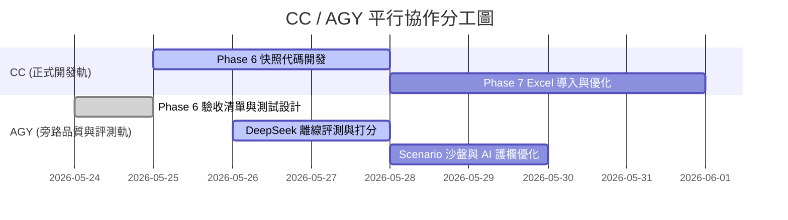

# 成熟產品演進 Roadmap 與分工白皮書 (ROADMAP_TO_MATURE_PRODUCT.md)

本文件對項目未來的長期成熟演進路線進行詳細規劃，重組 **Phase 6.x**、**Phase 7**、**Phase 8** 的開發順序，定義每一階段的業務產出、技術基底與驗收標準，並提供務實的 CC / AGY 協作分工指南。

---

## 1. 產品成熟形態願景 (Maturity Vision)

一個真正走向成熟、可在企業級環境中長期維護的 **ABF Capacity Calculator** 應具備以下特徵：
- **版本對決可回溯**：每次調整 Forecast 均有快照歷史，雙版本 Delta 秒開比對，直觀追蹤業績波動。
- **輸入極致高效**：電子表格 Tabular 編輯流暢無卡頓，支持 Excel 批量導入導出，與線下工作流無感契合。
- **沙盤模擬沙盒化**：用戶擁有獨立的 Sandbox 虛擬空間，可隨意模擬產能、價格、需求變化，不污染 production 真實數據。
- **AI 輔助決策安全化**：AI 分析離線大模型通過率 100% 綠過，且未經「人類在環」（Human-in-the-loop）明確確認前，AI 的任何優化建議**絕對不改寫**數據庫。

---

## 2. 建議的開發階段與順序 (Phased Roadmap)

我們基於產品可用性與開發難易度，重新排布了未來 4 大核心開發階段的順序：

```text
+------------------------------+      +------------------------------+
| Phase 6 & 6.1 (當前首要)     |      | Phase 7 (中期增強)            |
| - 快照對決比較 MVP            | ---> | - Products Spreadsheet 優化  |
| - 體積控制與 Firestore 權限   |      | - Excel 批量導入導出標準化    |
+------------------------------+      +------------------------------+
                                                      |
                                                      v
+------------------------------+      +------------------------------+
| Phase 8 (長期戰略)            |      | Phase 7.1 (沙盤模擬)         |
| - 離線大模型盲測與評測閉環   | <--- | - 獨立 Sandbox 虛擬克隆空間   |
| - AI 輔助與 Human-in-the-loop|      | - 產能/價格 Deterministic 模擬|
+------------------------------+      +------------------------------+
```

### 📅 各階段詳細規格與 technical foundation：

### 🟢 階段一：Phase 6 & 6.1 — Forecast Versioning MVP & Hardening
* **User-Facing Outcome**：用戶在調整預測後能手動保存快照，並在 Change Review 標籤頁秒級比對兩個版本之間的 12 大 Delta 對決指標及客戶/SKU對對碰表，一鍵導出離線 Change Pack。
* **Technical Foundation**：
  - Firestore 快照集合 path 規劃及 `allow update: if false;` 唯讀 rules。
  - 快照 Hybrid 存盤算法，鎖定 derived highlights 摘要（控制文檔 <100KB）。
  - 12 個對決指標在 core 計算層的算術實現。
* **驗收標準**：
  - 順利建立 2 個快照，比較面板正常渲染，導出 JSON 無隱私洩漏。
  - 測試與 Linter 零錯誤。
* **預估工作量**：**中 (2-3 天)**。

### 🟢 階段二：Phase 7 — Products Spreadsheet & Excel-like Workflow
* **User-Facing Outcome**： tabular 電子表格輸入無交互卡頓，支持 Ctrl+C/V 鍵盤快捷鍵拷貝，並支持批量導入/導出 standard Excel 規劃文件。
* **Technical Foundation**：
  - 優化 React 渲染週期，對 tabular 行組件實施 `React.memo` 淺層比對。
  - 引入 `xlsx` 或類似輕量化解析服務，在前端實現標準 Excel 與 Firestore 數據契約的雙向解析。
* **驗收標準**：
  - 導入 200 行 SKU 電子表格耗時 <1 秒，無瀏覽器卡死，導出格式與線下對齊。
* **預估工作量**：**大 (3-5 天)**。

### 🟢 階段三：Phase 7.1 — Scenario Planning (沙盤模擬沙盒化)
* **User-Facing Outcome**：用戶擁有獨立的 Sandbox 虛擬空間，可在不改動真實預測的前提下，建立多維虛擬 sandbox 情境（如同時模擬價格 -5% 且產能 +10%），秒級預覽 attainment。
* **Technical Foundation**：
  - 在服務層實現數據的深層克隆（Deep Clone）與內存緩存。
  - 隔離沙盒與 Firestore write 鏈路，保證 production 安全。
* **驗收標準**：
  - 沙盒模擬計算正確，退回 Dashboard 後真實數據 100% 毫無變化，零污染。
* **預估工作量**：**中 (2-3 天)**。

### 🟢 階段四：Phase 8 — AI-assisted Decision Workflow (AI 整合)
* **User-Facing Outcome**：當外部 AI 通過率達到 99% 時，可探索在後台代理服務器呼叫實體 AI API，為用戶直接在網頁上渲染 Change Review 報告。
* **Technical Foundation**：
  - 實施 Server-side sanitization 代理服務，擦除 API 傳輸隱私。
  - 實施 **Human-in-the-loop** 行動攔截，AI 給出的任何優化建議在未經 Owner 點擊確認前，絕對不寫入 Firestore。
* **驗收標準**：
  - AI 報告秒級解讀，所有建議均需人手二度審查，零自動寫入權限。
* **預估工作量**：**大 (4-7 天)**。

---

## 3. CC 與 AGY 平行分工與協作建議 (Collaboration Division)

為最大化發揮雙軌並行優勢，推薦 CC（業務與正式代碼開發）與 AGY（旁路架構審查、質量測評與 Prompt 防禦）進行以下分工：



- **CC 負責（正式代碼）**：
  1. 實作 Firestore 快照集合讀寫、軟刪除與安全 Rules。
  2. 實作 Compare Selector 下拉、12大 Delta 計算與前端 Table 渲染。
  3. 優化 Spreadsheet 性能，實作 Excel 導入導出服務。
- **AGY 負責（旁路評測）**：
  1. 提前準備驗收清單與 Benchmark Cases 測試數據（已交付）。
  2. 當 CC 交付 MVP 後，使用離線 Prompt 引導 DeepSeek 盲測，填寫評分卡，出具選型報告。
  3. 根據大模型反饋，微調離線 Prompt 護欄，向 CC 回饋 Prompt 進化建議，保障 AI 輔助決策的絕對安全。
