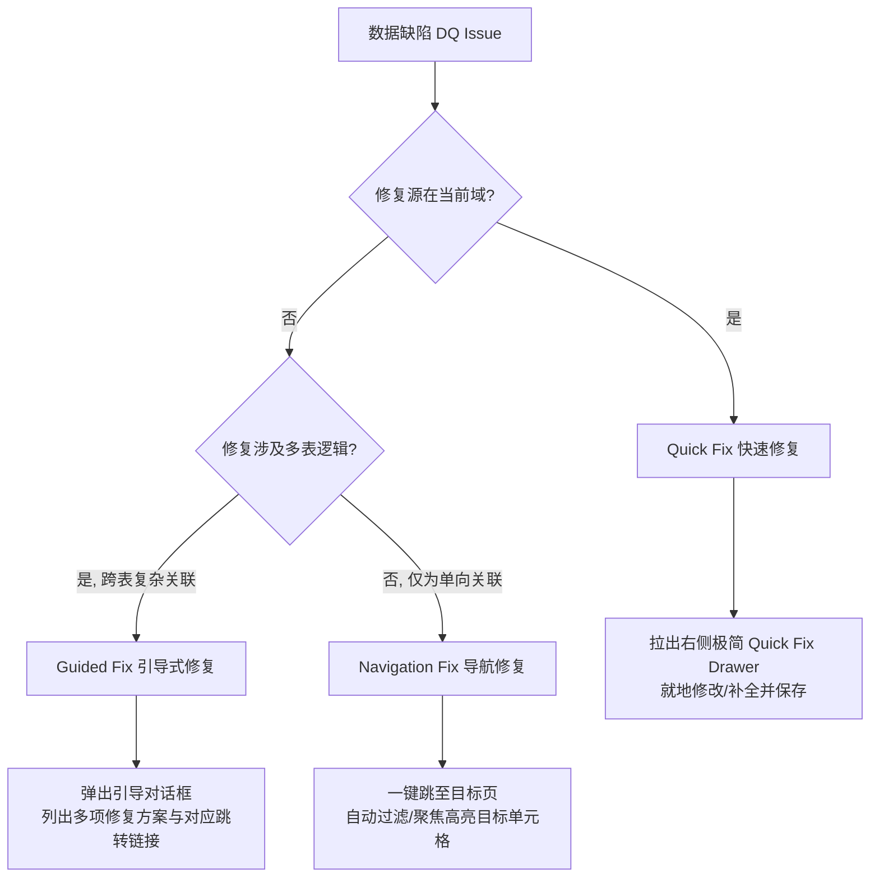

# v1.36.0 Data Quality Remediation Workflow 产品规格说明书 (Remediation Spec)

随着 `v1.35.0` 完成了数据质量在五个核心输入页面（Products, Forecasts, Capacity, BP Targets, Parameters）的即时可视化警示（DQ Visibility），用户已经能够“看见”数据的缺陷。然而，仅仅看见警示是不够的，如果用户必须在大范围、复杂的表格和页面跳转中手动定位并修复这些错误，会造成严重的体验中断。

为了提供极致的可用性，`v1.36.0` 专注于构建 **数据质量自愈闭环工作流 (Data Quality Remediation Workflow)**。本规格书基于 **第一性原理** 与 **KISS 原则**，重新定义数据自愈机制，确保在不污染数据、不修改底层计算核心与安全模型的前提下，帮助用户高效率地消除脏数据，为未来的沙盒多场景仿真（Scenario Planning）打下坚实、高置信度的数据基石。

---

## 一、 产品核心定位与自愈原则 (Core Principles)

在设计数据自愈工作流时，我们坚守以下三条核心设计原则：

1. **业务严谨性高于便捷性 (Rigorous First)**：
   * **绝对禁止“静默自动修复 (Silent Auto-save)”**。系统严禁在后台猜测用户意图并静默改写数据（例如自动将缺失的单价设为 1 或将缺失汇率补为 0）。所有修复操作必须经过有权限用户的确认或显式输入，以保证财务和产能规划数据 100% 符合真实的工业决策要求。
2. **就地闭环，最小化跳转 (Locality of UX)**：
   * 优先提供 **Quick Fix (快速修复)**。在当前页面点击缺陷警告，即时拉出右侧极简修复抽屉 (Quick Fix Drawer) 或弹出 Popover，就地补全缺陷字段并保存，消除多页面频繁切换造成的注意力割裂。
3. **架构极简化，禁止引入技术债 (Minimalist Architecture)**：
   * **严禁新增任何自定义数据模型 (No New Data Models)**。不需要建立类似 `dq_logs` 等新的 Firestore 集合或集合字段。
   * **100% 复用现有的 Service 保存接口**（如 `saveSku`、`saveForecast`、`saveCapacityPlan`、`saveParameters`、`saveBpTarget`），直接操作底层的原始字段，确保底层逻辑的高度一致与清爽。

---

## 二、 修复策略三分类规格 (Remediation Strategy Classifications)

我们针对现有的所有数据质量缺陷，依据“修复源所在域”和“业务逻辑依赖度”，将其归纳为三类修复策略：

### 1. Quick Fix (快速修复)
* **交互定义**：用户在当前页面点击缺陷行的 `DataQualityBadge` 或单元格内的红色/黄色警告图标时，系统**不跳转页面**，而是直接在屏幕右侧拉出 **`Quick Fix Drawer` (极简自愈抽屉)**。抽屉高亮显示并聚焦于缺失/有缺陷的属性，用户就地输入正确值并点击“保存自愈”，数据就地保存更新，抽屉关闭，全表 DQ 状态及计算结果即时刷新。
* **适用缺陷**：
  * Products 缺失生产或财务属性（单价/币别/尺寸/层数/分类等）。
  * Forecast 录入了零单价预测。
  * Parameters 缺失特定币别汇率或汇率小于等于 0。

### 2. Navigation Fix (导航修复)
* **交互定义**：缺陷的修复源在另一个页面。点击警告图标时，系统弹出一个小气泡，提供“一键导航前往修复 (Go to Fix)”链接。点击后，系统自动路由至目标页面，并**在 URL 中携带过滤或定位参数**，使目标页面加载时自动聚焦并高亮对应的输入框，引导用户操作。
* **适用缺陷**：
  * Forecast 缺失 SKU 引用（孤儿预测）：引导前往 Products 页面，自动高亮并过滤出该孤儿预测指向的 `skuId`，方便用户补全该 SKU；或者（可选）在 Quick Fix Drawer 中提供一个合法的 SKU 下拉选择框，允许用户就地重新关联该预测的 SKU，闭环修复。
  * BP Targets 缺失营业目标：在 Forecast 页面或分析页发现某年份有需求却无 BP 目标时，提供一键导航跳至 `BpTargets` 页，并自动定位高亮该年份的输入框。

### 3. Guided Fix (引导式修复)
* **交互定义**：缺陷由跨表复杂数据脱节引起，无法直接通过一键修单表解决。点击警示时，系统弹出 **`Guided Fix Modal` (引导修复对话框)**，为用户清晰列出产生该问题的根本原因以及 **2-3 种可行的修补路径（带跳转链接）**，由用户根据真实业务场景决定如何修复。
* **适用缺陷**：
  * Capacity 缺失：当前月份存在预测需求，但未配置该月的任何产能。
  * BU 产能缺失 (bu-demand-zero-capacity)：该月有高层数 SKU 预测需求，但所有工厂的 Build-up 产能配置总和却为 0。可能需要：(1) 到 Capacity 补配产能；(2) 到 Forecasts 砍掉该月的高层数预测需求；(3) 到 Products 修改该 SKU 的层数分类。引导对话框需完整呈现这三种跳转修补路径。

---

## 三、 多人协作角色权限控制 (Role-Based Remediation Rules)

在多人协同工作区下，必须严格根据用户角色隔离修复权限，防止越权行为：

| 角色 (Role) | DQ 可见性 (Visibility) | 触发自愈交互 (Trigger Interaction) | 可编辑/可保存字段 | Firestore 写入拦截 |
| :--- | :---: | :--- | :--- | :---: |
| **Owner** | **完整可见** | 可完整触发 Quick Fix Drawer、Navigation 导航、Guided Fix 弹窗。 | 可修齐所有 SKU 属性、预测单价、汇率、产能以及营业目标。 | 允许物理写入 |
| **Editor** | **完整可见** | 可完整触发 Quick Fix Drawer、Navigation 导航、Guided Fix 弹窗。 | 可修改大部分规划与预测数据，但受限于 `firestore.rules` 约定的写权限范围。 | 允许物理写入 |
| **Viewer** | **完整可见** | **禁止触发任何修复交互**。点击 DQ Badge 或 Alert 时，只弹出一个只读的“缺陷诊断详情 (Diagnostics Detail)”小气泡或抽屉，且**所有的输入框、确认保存按钮一律保持 disabled 状态**。 | 任何字段均不允许修改。 | **硬性物理拦截** (防止前端恶意伪造请求) |

---

## 四、 六大核心 DQ 缺陷修复规格与数据流 (Spec details)

下面针对用户重点提出的 6 类核心 DQ 问题，制定精准的自愈数据流与 UX 规格：

### 1. Products missing unit price / currency / size / layer / application
* **缺陷特征**：SKU 缺失单价、币别、尺寸、层数或应用分类，或数值小于等于 0。
* **修复策略**：**Quick Fix**。
* **交互设计**：
  1. 在 `Products.tsx` 的 SKU 列表行中，点击红色的 DQ 错误图标。
  2. 屏幕右侧拉出 **`SKU Quick Fix Drawer`**，标题为 `快速修复产品 SKU - [skuId]`。
  3. 抽屉内展示该 SKU 的所有表单输入项，缺失的字段（如 `layerCount` 或 `unitPrice`）用红色高亮边框标识，并配有“此为核心分析属性，不能为空”的提示字样。
  4. 用户就地修改/补齐该字段，点击底部的“确认自愈”按钮。
* **数据流与 API 挂接**：
  * 阻断任何无修改保存。
  * 调用现有的 `skuService.saveSku(skuId, updatedSkuData)` 进行更新。
  * **即时自愈机制**：保存成功后，利用 React 本地 State 的 SKU 数组触发页面重新渲染。由于 State 更新，顶层计算 `buildDataQualitySummary` 自动重算，该 SKU 行 of 红色 Error 图标即时消失，化为绿色的 Check 或直接无警示。

### 2. Forecast missing SKU reference (孤儿预测)
* **缺陷特征**：预测记录中填写的 `skuId` 在 SKU 主表中不存在。
* **修复策略**：**Quick Fix 与 Navigation Fix 双通道**。
* **交互设计**：
  1. 在 `Forecasts.tsx` 的编辑列表中，针对背景呈浅红色的孤儿预测行，点击 SKU ID 旁边的红色错误图标。
  2. 弹出的 Quick Fix Popover 给予用户两种选择：
     * **方案 A (Quick Fix)**：在气泡中提供一个下拉选择框（Select SKU），加载当前系统中**所有已存在的合法 SKU 列表**。用户可以在下拉框中选择一个正确的 SKU，点击“重绑定”，就地将这笔预测数据重新关联到合法的 SKU。
     * **方案 B (Navigation Fix)**：提供“一键去 Products 页新增该 SKU”链接。点击后，路由跳转到 `/products`，并自动打开“新增 SKU”对话框，且 `skuId` 已经默认填入该缺失的代号，引导用户一键建档。
* **数据流与 API 挂接**：
  * 方案 A 下，调用现有的 `forecastService.saveForecast(forecastId, { ...forecast, skuId: selectedSkuId })`。
  * 保存成功后即时刷新前端 Forecasts 数组状态，孤儿行的浅红警示底色即时消除。

### 3. Forecast with zero price
* **缺陷特征**：具体的月度预测记录中，虽然有需求片数，但填写的 `unitPrice` 恰好等于 0，导致潜在的收入漏计风险。
* **修复策略**：**Quick Fix**。
* **交互设计**：
  1. 在 `Forecasts.tsx` 的表格单元格中，如果检测到单价为 0，该单元格底色变浅黄，并显示黄色警告。
  2. 双击或点击该单元格，直接原地激活 Input 编辑态（或在 SpreadSheet 中聚焦该单元格直接键盘输入）。
  3. 用户输入有效价格，按下 Enter 键或失焦（blur），触发保存。
* **数据流与 API 挂接**：
  * 复用 `forecastService.saveForecast(forecastId, { ...forecast, unitPrice: enteredPrice })`。
  * 修改完成后，单元格的黄色警告即时退散，重新调用 `runCalculation` 刷新收入预测。

### 4. Capacity missing / zero capacity with demand
* **缺陷特征**：当前月存在 SKU 预测需求，但未配置该月的任何工厂产能配置（或高层数产品需求存在，但 Build-up 产能配置为 0）。
* **修复策略**：**Guided Fix (引导式修复)**。
* **交互设计**：
  1. 由于该缺陷通常显示在产能页面的顶端 ActionBar 或分析 Dashboard 上。
  2. 用户点击 Alert 横幅“发现有预测需求月份缺少产能规划（如：2026-03）”旁边的“去解决 (Remediation)”按钮。
  3. 弹出 **`Capacity Deficiency Remediation Modal`**（产能缺陷自愈引导窗口），分析并提供以下业务选项：
     * **选项一（推荐）**：“去配置产能” ── 提供一键跳转至 `Capacity` 页面的链接，并在 URL 中附带参数 `?focusMonth=2026-03&focusField=corePanel`。目标页加载后，自动过滤至 2026 年，并对 03 月的 Core Panel 输入框施加高亮闪烁效果，吸引用户填入数据。
     * **选项二**：“查看该月的预测需求” ── 提供一键跳转至 `Forecasts` 页面，过滤出 2026 年 03 月所有产生该需求的 SKU，让用户核实预测需求是否录入错误。
* **数据流与 API 挂接**：
  * 跳转至 `Capacity` 页面并录入产能后，用户点击产能页的保存按钮。
  * 调用现有的 `capacityService.saveCapacityPlan(monthId, capacityData)`。
  * 保存成功后，全局 DQ 警示横幅即时消除。

### 5. BP Targets missing yearly target
* **缺陷特征**：系统某年份存在有效 SKU 需求预测，但 `bpTargets` 中该年份的营业目标未配置（为 null 或 0）。
* **修复策略**：**Navigation Fix (导航定位修复)**。
* **交互设计**：
  1. 在 `BpTargets.tsx` 页面顶部 Alert 呈现“发现当前预测周期（如：2026）缺失营业目标设定”。
  2. 点击 Alert 右侧的“去设定 (Fix Target)”按钮。
  3. 页面无大跳转，仅视口自动滚动平滑锚定至 BpTargets Table 中的 **2026 年营业额目标输入单元格**，输入框呈现高亮虚线框并自动聚焦，引导用户快速输入。
* **数据流与 API 挂接**：
  * 用户输入数值，点击“保存目标”。
  * 挂接现有的 `bpTargetService.saveBpTarget(year, amount)`。
  * 保存完毕后，顶部黄色 Alert 即时褪去。

### 6. Parameters exchange rate missing / invalid
* **缺陷特征**：SKU 或 Forecast 中使用了 TWD/CNY 计价，但 Parameters 页面中 constant 或 yearly 下对应的汇率缺失或小于等于 0。
* **修复策略**：**Quick Fix**。
* **交互设计**：
  1. 在 `Parameters.tsx` 页面中，在汇率设定卡片标题旁，如果存在此问题，显示红色错误 Badge。
  2. 点击 Badge 弹出一个 **`Exchange Rate Quick Fix Popover`**（汇率快捷自愈气泡）。
  3. 气泡中自动分析并指出：“当前有 X 个 SKU 采用 TWD 计价，但尚未配置汇率。请输入常数汇率：”
  4. 气泡中直接提供一个输入框 `TWD/USD 汇率`（如 `0.031`）。
  5. 用户输入并点击“即时补全”，系统后台将该数值写入参数集合。
* **数据流与 API 挂接**：
  * 拦截无效的非数字或负数汇率。
  * 写入至 `parameterService.saveParameters(updatedParams)`。
  * **即时更新机制**：写入成功后，Parameters 卡片红色 Badge 变绿，且系统所有涉及 TWD 的 SKU 营收重算即时执行，抹除报错状态。

---

## 五、 自愈工作流前端交互规范与体验刷新机制 (UX Flow)

### 1. 缺陷高亮自愈三阶段
1. **警示阶段 (Awareness)**：所有页面级 DQBadge 均具备清晰的 Tooltip。Hover 时显示错误类型（例如：`decisionImpact: error` 用红色，`warning` 用黄色）。
2. **就地激活 (Action)**：点击 Badge，阻止常规表格行选中或编辑冒泡，直接原地拉出 `Quick Fix Drawer`，提供沉浸式修单体验。
3. **自愈刷新 (Remediation)**：点击保存后，UI 会在按钮上显示 `loading` 状态。写入 Firebase 成功后，由 React 顶层 Context 触发 `recalculateDQ()`。全站各处的警示 Badge 重新执行判定逻辑并隐去，让用户获得极强的“打怪升级、清理缺陷”的爽快感与获得感。

### 2. 严禁事项与架构约束 (Strict Constraints)
* **严禁重复造轮子**：React 各页面组件内部不得自行维护一套复杂的 DQ 缺陷验证逻辑，检测条件必须由统一的 `core/dataQuality.ts` 返回，页面只负责基于 Issue 对象的 domain、type 进行交互响应。
* **严禁越过只读硬防线**：当工作区为 Viewer 角色时，前端虽然能看到所有的 DQ Badge，但**严禁为 Badge 挂接任何 onClick 弹窗/抽屉事件**，点击没有任何破坏性响应，保障只读的物理安全。
