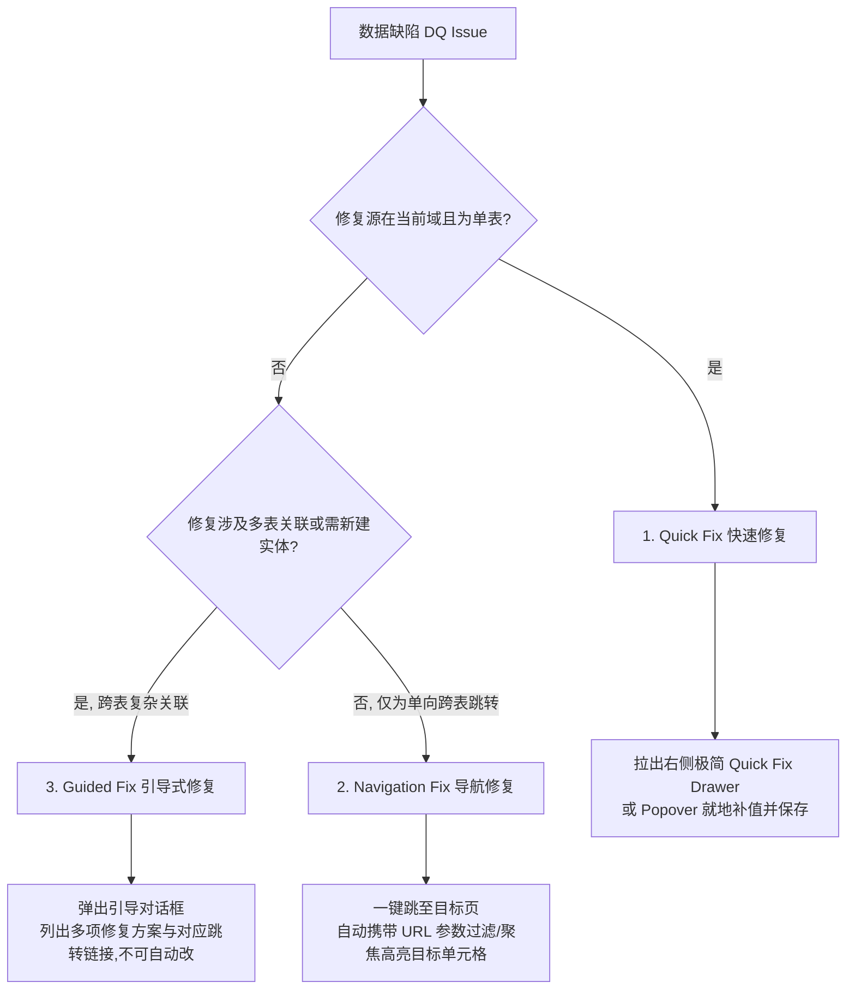

# v1.36.0 Data Quality Remediation Workflow 产品规格说明书 (Remediation Spec)

随着 `v1.35.0` 完成了数据质量在五个核心输入页面（Products, Forecasts, Capacity, BP Targets, Parameters）的即时可视化警示（DQ Visibility），用户已经能够“看见”数据的缺陷。然而，仅仅看见警示是不够的，如果用户必须在大范围、复杂的表格和页面跳转中手动定位并修复这些错误，会造成严重的体验中断。

为了提供极致的可用性，`v1.36.0` 专注于构建 **数据质量自愈闭环工作流 (Data Quality Remediation Workflow)**。本规格书基于 **第一性原理** 与 **KISS 原则**，重新定义数据自愈机制，确保在不污染数据、不修改底层计算核心与安全模型的前提下，帮助用户高效率地消除脏数据，为未来的沙盒多场景仿真（Scenario Planning）打下坚实、高置信度的数据基石。

---

## 一、 业务背景与“自愈闭环”产品定位

在 `v1.35` 版本中，我们成功实现了 “Shift-Left” 的数据质量前移，在各个输入端通过 `DataQualityBadge` 和 `DataQualityAlert` 将脏数据暴露给用户。

但是在实际业务中，我们面临一个巨大的痛点：**看见问题，却难以修复**。例如，用户在 `Forecasts` 页面看到一个 SKU 的预测单价为 0，他需要跳转回 `Products` 页面修改单价，或者在 `Forecasts` 的庞大表格中苦苦搜寻对应的单元格进行修改。若是遇到孤儿预测，用户更需要在两个页面间反复切换核对，这严重阻碍了录入效率。

为了保障下一步 **Scenario Planning (场景规划)** 的决策可信度，数据必须是 100% 干净且合规的。因此，`v1.36` 暂缓 Scenario Planning 的开发，将全部精力集中于 **Data Quality Remediation (数据质量自愈)**。我们的产品定位是：**就地修补，即时自愈，零数据污染，极简交互**。

---

## 二、 核心自愈原则 (Core Principles)

在设计与实施数据自愈工作流时，必须坚守以下五条底层设计原则：

1. **业务严谨性高于便捷性 (Rigorous First - 绝对禁止后台静默修复)**：
   * **绝对禁止“静默自动修复 (Silent Auto-save)”**。系统严禁在后台猜测用户意图并静默改写数据（例如自动将缺失的单价设为 1 或将缺失汇率补为 0.03）。所有修复操作必须经过有权限用户的确认或显式输入，以保证财务和产能规划数据 100% 符合真实的工业决策要求。
2. **就地闭环，最小化跳转 (Locality of UX)**：
   * 优先提供 **Quick Fix (快速修复)**。在当前页面点击缺陷警告，即时拉出右侧极简修复抽屉 (Quick Fix Drawer) 或弹出 Popover，就地补全缺陷字段并保存，消除多页面频繁切换造成的注意力割裂。
3. **架构极简化，物理禁止引入技术债 (No New Data Models)**：
   * **严禁新增任何自定义数据模型**。不需要建立类似 `dq_logs` 或 `quick_fixes` 等新的 Firestore 集合或集合字段。
   * **100% 复用现有的 Service 保存接口**（如 `skuService.saveSku`、`forecastService.saveForecast`、`capacityService.saveCapacityPlan`、`parameterService.saveParameters`、`bpTargetService.saveBpTarget`），直接操作底层的原始字段，确保底层物理数据高度一致。
4. **即时重算，无刷新刷新 (Stateless Instant Refresh)**：
   * 自愈成功后，必须通过 React 状态机（State / Context）更新本地的数据状态数组，从而自动触发 `buildDataQualitySummary` 的实时重算与页面的重新渲染。**严禁通过 `window.location.reload()` 这种粗暴的整页强制刷新方式来消除错误 Badge**。
5. **只读工作区物理红线保护 (Viewer Gate)**：
   * Viewer 角色虽然拥有完整的 DQ 知情权，但前端组件中**严禁为 Viewer 角色绑定任何 onClick 自愈事件**。所有的修复 Drawer、Popover、Modal 对 Viewer 一律不响应，物理按钮强置灰，绝无任何物理提交可能。

---

## 三、 修复策略三分类规格 (Remediation Strategy Classifications)

我们针对现有的所有数据质量缺陷，依据“修复源所在域”和“业务逻辑依赖度”，将其归纳为三类修复策略：

### 1. Quick Fix (快速修复)
* **交互定义**：用户在当前页面点击缺陷行的 `DataQualityBadge` 或单元格内的警告图标时，系统**不跳转页面**，直接在屏幕右侧拉出 **`Quick Fix Drawer`** 或弹出 **`Popover` 气泡**。用户在其中输入正确值并点击保存，数据就地保存更新，表单关闭，全表 DQ 状态及计算结果即时刷新。
* **适用缺陷**：
  * Products 缺失生产或财务属性（单价/币别/尺寸/层数/应用分类等）。
  * Forecast 录入了零单价预测。
  * Parameters 缺失特定币别汇率或汇率小于等于 0。
  * BP Targets 缺失年度营业目标（可在此页面的 Alert 气泡内就地补值）。

### 2. Navigation Fix (导航修复)
* **交互定义**：缺陷的修复源在另一个页面。点击警告图标时，系统提供“一键导航前往修复 (Go to Fix)”链接。点击后，系统自动路由至目标页面，并在 **URL 中携带过滤或定位参数**，使目标页面加载时自动平滑滚动并聚焦高亮对应的输入框，引导用户操作。
* **适用缺陷**：
  * Capacity 缺失（某月存在有效需求预测但缺失产能）：引导前往 `Capacity` 页面，自动高亮并定位至该年份月份的产能输入框。

### 3. Guided Fix (引导式修复)
* **交互定义**：缺陷由跨表复杂数据脱节引起，无法直接通过一键修单表解决。点击警示时，系统弹出 **`Guided Fix Modal` (引导修复对话框)**，为用户清晰列出产生该问题的根本原因以及 **2-3 种可行的修补路径（带跳转链接）**，由用户根据真实业务场景决定如何修复。
* **适用缺陷**：
  * Forecast 缺失 SKU 引用（孤儿预测）：要求使用者建立 SKU 或修正预测 reference。
  * 需求存在但产能为零（高层数 SKU 需求 vs BU 产能为零）：该月有高层数 SKU 预测需求，但 Build-up 产能配置为 0。

---

## 四、 多人协同角色权限控制 (Role-Based Remediation Rules)

在多人协同工作区下，必须严格根据用户角色隔离修复权限，防止越权行为：

| 角色 (Role) | DQ 可见性 (Visibility) | 触发自愈交互 (Trigger Interaction) | 可编辑/可保存字段 | Firestore 写入拦截 |
| :--- | :---: | :--- | :--- | :---: |
| **Owner** | **完整可见** | 可完整触发 Quick Fix Drawer、Popover、Navigation 导航、Guided Fix 弹窗。 | 可修齐所有 SKU 属性、预测单价、汇率、产能以及营业目标。 | 允许物理写入（安全规则放行） |
| **Editor** | **完整可见** | 可完整触发 Quick Fix Drawer、Popover、Navigation 导航、Guided Fix 弹窗。 | 可修改大部分规划与预测数据，但受限于 `firestore.rules` 约定的写权限范围。 | 允许物理写入（安全规则放行） |
| **Viewer** | **完整可见** | **禁止触发任何修复交互**。点击 DQ Badge 或 Alert 时，只弹出一个只读的“缺陷诊断详情”小气泡，且**所有的输入框、确认保存按钮一律保持 disabled 状态**。 | 任何字段均不允许修改。 | **硬性物理拦截**（受 `firestore.rules` 保护，防止前端恶意篡改） |

---

## 五、 六大核心 DQ 缺陷修复规格与数据流 (Spec Details)

### 1. Products missing unit price / currency / size / layer / application
* **检测条件**：当 SKU 缺失 `unitPrice`、`currency`、`chipLengthMm`、`chipWidthMm`、`layerCount`、`application` 中的任意一项，或这些数值小于等于 0 时。
* **修复策略**：**Quick Fix** (右侧 SKU 快速修补抽屉)。
* **前端交互流程**：
  1. 在 `Products.tsx` 的 SKU 列表行中，点击红色的 DQ 错误图标 `DataQualityBadge`。
  2. 阻止行选中与编辑事件冒泡。
  3. 屏幕右侧拉出 **`SKU Quick Fix Drawer`**，标题为 `快速修复产品 SKU - [skuId]`。
  4. 抽屉内展示该 SKU 的所有表单输入项，缺失或不合法的字段（如 `layerCount` 缺失）用红色高亮边框标识，并配有“此为核心分析属性，不能为空且必须大于0”的提示字样。
  5. 用户就地修改/补齐该字段，点击底部的“确认自愈”按钮。
* **数据流与 API 挂接**：
  * 拦截无效的非正数、非数字或空值。
  * 调用现有的 `skuService.saveSku(skuId, updatedSkuData)` 进行更新。
  * **即时自愈机制**：保存成功后，利用 React 本地 State 的 SKU 数组触发页面重新渲染。由于 State 更新，顶层计算 `buildDataQualitySummary` 自动重算，该 SKU 行的红色 Error 图标即时消失，化为绿色的 Check 或直接无警示。

### 2. Forecast missing SKU reference (孤儿预测)
* **检测条件**：预测条目关联的 `skuId` 在 SKU 主表中不存在。
* **修复策略**：**Guided Fix (引导式修复)**。
* **前端交互流程**：
  1. 在 `Forecasts.tsx` 的编辑列表中，针对背景呈浅红色的孤儿预测行，点击 SKU 编码旁边的红色错误图标。
  2. 弹出 **`Orphan Forecast Guided Fix Modal`**，清晰指出：“当前预测需求指向的 SKU ID `[skuId]` 在产品主库中不存在，这将导致后续产能及营业达成率分析无法归类。”
  3. 提供以下 3 条自愈与修正路径：
     * **路径 A（推荐）**：提供 “去 Products 页面新建该 SKU” 链接。点击后路由跳转至 `/products`，并自动打开“新增 SKU” 弹窗/Drawer，且 `skuId` 已经默认填入该缺失的代号，引导用户一键建档。
     * **路径 B**：提供 “去 Forecasts 编辑器修正此引用的 SKU” 链接。自动关闭 Modal，並聚焦并激活该预测行的 SKU 下拉编辑框，引导用户重新绑定为已存在的合法 SKU。
     * **路径 C**：提供 “删除此笔无主预测” 按钮。用户确认后，就地物理删除该行预测数据，彻底消除孤儿漏洞。
* **数据流与 API 挂接**：
  * 路径 B 调用 `forecastService.saveForecast(forecastId, { ...forecast, skuId: selectedSkuId })`。
  * 路径 C 调用 `forecastService.deleteForecast(forecastId)`。
  * 保存成功后即时刷新前端 Forecasts 数组状态，孤儿行的浅红警示底色即时消除。

### 3. Forecast with zero price
* **检测条件**：具体月份预测记录的 `unitPrice` 存在且为 0（或缺失）。
* **修复策略**：**Quick Fix** (就地激活单元格编辑或 Popover 补值)。
* **前端交互流程**：
  1. 在 `Forecasts.tsx` 的表格单元格中，如果检测到单价为 0，该单元格底色变浅黄，并显示黄色警告。
  2. 鼠标双击或点击该单元格，直接原地激活 `InputNumber` 编辑态（或在 SpreadSheet 中聚焦该单元格直接键盘输入）。
  3. 用户输入有效价格（必须大於 0），按下 Enter 键或失焦（blur），触发保存。
* **数据流与 API 挂接**：
  * 拦截无效的负数或空值。
  * 复用 `forecastService.saveForecast(forecastId, { ...forecast, unitPrice: enteredPrice })`。
  * 修改完成后，单元格的黄色警告即时退散，重新调用 `runCalculation` 刷新收入预测。

### 4. Capacity missing / zero capacity with demand
* **检测条件**：当前月份存在有效的 SKU 需求预测，但是整个系统中未在任何工厂配置该月份的产能记录；或者是存在层数大于等于 4 的高层数 SKU 需求，但 Build-up (BU) Panel 产能配置总和却为 0。
* **修复策略**：
  * **产能记录完全缺失**：**Navigation Fix (导航修复)**。
  * **高层数 SKU 需求 vs BU 产能为零**：**Guided Fix (引导式修复)**。
* **前端交互流程**：
  * **产能记录完全缺失**：
    1. 用户在 CapacityPlan 页面顶部的 ActionBar 或者是 Table 表头点击紅色警示 Alert 旁的 “去解决 (Fix)” 按钮。
    2. 系统路由跳转至 `/capacity`，並在 URL 中携带參數 `?focusMonth=YYYY-MM`。
    3. 目标页面加载后，自动过滤到该年份，视口自动滚动并定位至该月份的 `corePanel` 输入框，且输入框应用明显的 CSS 高亮闪烁效果。
  * **高层数 SKU 需求 vs BU 产能为零**：
    1. 点击警告图标，弹出 `BU Capacity Deficiency Guided Modal`。
    2. 为用户列出产生该问题的根本原因（如：2026-03 存在高层数产品需求，但 Build-up 产能配置为 0），并提供以下修补路径：
       - **路径 A**：“去配置产能” ── 提供跳转至 `/capacity` 链接，携带 `?focusMonth=2026-03&focusField=buPanelPerDay` 参数，自动聚焦并闪烁该输入框。
       - **路径 B**：“调整需求预测” ── 提供一键跳转至 `Forecasts` 页面，过滤出该月份下所有高层数 SKU 预测需求，方便用户砍掉或调整该笔需求。
* **数据流与 API 挂接**：
  * 在 Capacity 页面录入产能后，用户点击保存，复用 `capacityService.saveCapacityPlan(monthId, capacityData)`。
  * 保存成功后，全局 DQ 警示横幅即时消除。

### 5. BP Targets missing yearly target
* **检测条件**：系统存在某年份的有效 SKU 需求预测，但 `bpTargets` 中该年份的营业目标未配置（为 null 或 0）。
* **修复策略**：**Quick Fix** (就地小表单直接补值)。
* **前端交互流程**：
  1. 在 `BpTargets.tsx` 页面顶部或 Forecasts 页面顶部展示 Alert ：“发现当前预测周期（如：2026）缺失营业目标设定”。
  2. 点击 Alert 右侧的 “快速自愈 (Quick Fix)” 按钮。
  3. 不做页面大跳转，在 Alert 旁直接展开一个极简的 Inline Form（行内小表单），包含一个 `Target Amount` 输入框与“确定保存”按钮。
  4. 用户就地输入有效年度营业目标（必须大於 0），点击保存，完成自愈。
* **数据流与 API 挂接**：
  * 拦截无效的负值或空值。
  * 挂接现有的 `bpTargetService.saveBpTarget(year, amount)`。
  * 保存完毕后，顶部黄色 Alert 即时褪去，营业达成率分析即时刷新。

6. **Parameters exchange rate missing / invalid**
* **检测条件**：系统中存在 TWD 或 CNY 币别计价的 SKU，但在当前汇率设置中 constant 或 yearly 模式下未配置对应的汇率或汇率小于等于 0。
* **修复策略**：**Quick Fix** (Popover 气泡小表单就地补值)。
* **前端交互流程**：
  1. 在 `Parameters.tsx` 页面中，在汇率设定卡片标题旁，如果存在此问题，显示红色错误 Badge。
  2. 点击 Badge 弹出一个 **`Exchange Rate Quick Fix Popover`**（汇率快捷自愈气泡）。
  3. 气泡中自动分析并指出：“当前有 X 个 SKU 采用 TWD 计价，但尚未配置汇率。请输入常数汇率：”
  4. 气泡中直接提供一个输入框 `TWD/USD 汇率`（如 `0.031`）。
  5. 用户输入并点击“即时补全”，系统后台将该数值写入参数集合。
* **数据流与 API 挂接**：
  * 拦截无效的非正数。
  * 写入至 `parameterService.saveParameters(updatedParams)`。
  * **即时更新机制**：写入成功后，Parameters 卡片红色 Badge 变绿，且系统所有涉及 TWD 的 SKU 营收重算即时执行，抹除报错状态。

---

## 六、 严禁事项与架构约束 (Strict Constraints)

1. **绝对禁止修改前端 `frontend/src` 以外的任何环境及依赖**。本期规格受硬性限制约束，**不修改 `frontend/src`（本次仅新增设计规格文档）**，在此为将来的实作确立严格红线：将来开发时不得升版、不得修改 `firestore.rules`。
2. **严禁越过只读硬防线**：当工作区为 Viewer 角色时，前端虽然能看到所有的 DQ Badge，但**严禁为 Badge 挂接任何 onClick 弹窗/抽屉/自愈事件**，点击没有任何破坏性响应，保障只读的物理安全。
3. **严禁在 React 组件内部手写冗余检测逻辑**：所有的 DQ 状态和检测条件必须由统一的 `core/dataQuality.ts` 引擎判断返回，页面组件只负责基于 Issue 对象进行交互展现与 API 挂接，保证“单一真理源 (Single Source of Truth)”。

---

## 七、 页面交互与自愈体验刷新机制 (UX Flow)

### 1. 缺陷高亮自愈三阶段
1. **警示阶段 (Awareness)**：所有页面级 DQBadge 均具备清晰的 Tooltip。Hover 时显示错误类型（例如：`decisionImpact: error` 用红色，`warning` 用黄色）。
2. **就地激活 (Action)**：点击 Badge，阻止常规表格行选中或编辑冒泡，直接原地拉出 `Quick Fix Drawer`，提供沉浸式修单体验。
3. **自愈刷新 (Remediation)**：点击保存后，UI 会在按钮上显示 `loading` 状态。写入 Firebase 成功后，由 React 顶层 Context 触发 `recalculateDQ()`。全站各处的警示 Badge 重新执行判定逻辑并隐去，让用户获得极强的“清理缺陷、消灭警报”的掌控感与高置信度分析体验。
