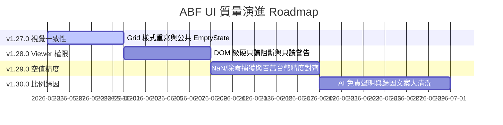

# 全站 UI 質量演進藍圖 (UI Quality Roadmap v1.27.0 - v1.30.0)

为了实现 ABF 产能计算器从“功能堆叠”向“成熟、统一、高可信度商业 SaaS 产品”的演进，特制定本全站 UI 质量演进 Roadmap。

本路线图坚持 **“灰度并行、稳字当头、P0 优先、KISS 极简”** 的软件工程原则，在接下来的四个版本中渐进式、低风险地合并落地。

---

## 📅 表格标准化与 UI 质量演进路线

---

## 🎨 1. v1.27.0：Low-risk Visual Consistency (視覺 Parity 灰度)
* **核心 Scope**：
  - 物理重写 `react-datasheet-grid` 样式类，使其表头底色（#fafafa）、悬浮行、蓝色聚焦激活边框（#1677ff）与项目主 Ant Design 100% 视觉对齐。
  - 导入通用分子级 `EmptyState` 组件，优雅替换 Products 页面和 Forecasts 表格为空时的秃头裸露状态。
  - 归一化全站 Card 投影（box-shadow）与 padding 间距，彻底消除“卡片嵌套卡片”的破碎视觉。
* **物理禁止事项**：
  - 严禁触碰/修改任何 core formulas 和计算逻辑。
  - 严禁修改 firestore.rules 或 package 依赖，不改动任何数据流。
* **最高驗收標準**：
  - 任意 Lab 表格高亮呈现温和蓝色边框，视觉 Parity 100% 对齐。
  - 空状态下，用户可看到精致的 AntD Empty 卡片及一键跳转 Products 引导。

---

## 🔐 2. v1.28.0：Viewer True Read-Only (只讀權限 DOM 級硬鎖)
* **核心 Scope**：
  - 依据 📄 [VIEWER_READONLY_FIX_SPEC.md](file:///D:/abf-capacity-calculator-agy/docs/design-system/VIEWER_READONLY_FIX_SPEC.md)，在四大大表网格中统一绑定 `lockRows={!writable}` 并为列配置注入 `disabled: !writable`，在 DOM 级物理掐断只读用户的本地编辑、Backspace 及 Ctrl+V 粘贴。
  - 绑定 onChange 前置哨兵 guard 防改本地 state；Parameters 所有 Input 绑定 `disabled={!writable}`。
  - Viewer 下顶部渲染唯读 Alert 警示横幅。
* **物理禁止事项**：
  - 严禁仅前端隐藏 [Save] 按钮而漏防 DOM 网格编辑。
* **最高驗收標準**：
  - 唯读角色双击大网格无法聚焦、不弹起输入光标、无法粘贴；唯读警告横幅正常亮起，0 越权虚假编辑。

---

## 📈 3. v1.29.0：NaN / Empty / Unit Display (空值與財務精度對帳治理)
* **核心 Scope**：
  - 依据 📄 [NAN_EMPTY_UNIT_DISPLAY_SPEC.md](file:///D:/abf-capacity-calculator-agy/docs/design-system/NAN_EMPTY_UNIT_DISPLAY_SPEC.md)，在前端最后一公里全局捕获 NaN 及除零的 `Infinity`，统一将其降级重绘为灰色短横线 `—`（或 `— (停機)`）。
  - Results 报表所有表头加上括号物理单位说明（如 `目標營收 (百萬新台幣)`）。
  - 统一数值列 **靠右对齐 (tabular-nums)**，使用等宽字体。
* **物理禁止事项**：
  - 绝对禁止在 Firestore 数据保存层写入 dummy 占位符，数值 fallback 必须死锁在前端 render 端，严防底层数据二次污染。
* **最高驗收標準**：
  - 极端 0值分母或未考核年份在 Results 中 100% 优雅呈现，不爆 NaN 或 Infinity，财务达成率对账精度达到 100.00% 零残差。

---

## 🌐 4. v1.30.0：Attribution Copy Governance (比例歸因文案安全防線)
* **核心 Scope**：
  - 依据 📄 [ATTRIBUTION_COPY_GOVERNANCE_SPEC.md](file:///D:/abf-capacity-calculator-agy/docs/design-system/ATTRIBUTION_COPY_GOVERNANCE_SPEC.md)，对 `en.ts` / `zhTW.ts` 的翻译字典执行大清洗，将带有强定法定性的因果判断词（cause, caused by, 导致, 造成）彻底擦除，替换为中性的比例分摊归因（associated, attribution, 贡献, 占比相关）。
  - 在 AI Risk Brief 导出头部及文本注入标准的地道繁中/英文免责置信度水印。
  - 结果报表顶部常设 `DataCaveatAlert` 置信度信息卡，明示 deterministic 运筹。
* **物理禁止事项**：
  - 严禁在 AI brief export 中直接展示未清理 token 的数据或使用强因果 Prompt 诱导 AI 生成偏失报告。
* **最高驗收標準**：
  - 跨快照主要变更与 AI 导出简报 100% 对齐“数学分摊占比”口径，0 因果定性纠纷隐患。
