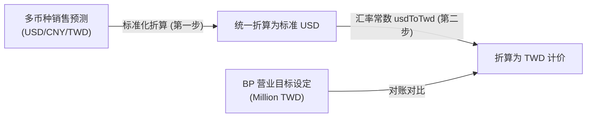

# BP 与币别/分析风险说明 (BP Targets Analysis Risk Review)

在将 **BP Targets** 从零散的 `Parameters` 整合并重构为独立 Excel-like 页面（v1.25.0）的过程中，开发团队 (CC) 极易在“汇率多币种换算”、“时间跨度分摊假设”以及“下游分析归因逻辑”中埋下致命的商业计算漏洞。

特此对以下 5 大核心计算架构与商业逻辑风险进行深度盘点，请 CC 团队在实现时高度警戒。

---

## ⚠️ 5 大核心计算架构与商业逻辑风险

### 1. 币种不一致与二次折算（Double Conversion）精度风险
* **事实背景**：
  - 录入的 **BP Targets** 的法定物理单位是：**百万新台币 (Million TWD)**。
  - 系统的 SKU 售价与销售预测（Forecasts）数据可能是 **USD（美金）**、**CNY（人民币）** 或 **TWD（新台币）** 多币种混合。
* **致命风险**：
  - 研发在编写 BP 达成率对比分析（BP Analysis）时，如果将多币种预测直接折算为 TWD，再与 BP Target 对比，会因为汇率常数读取时点不同或汇率截断误差造成“数据对账不齐”。
* **规避策略 (CC 必须遵循)**：
  - **折算两步走**：销售预测（Forecasts）在折算时，必须**统一先标准化折算为 USD（美元）**。
  - **终点对账**：将以 USD 为标准单位汇总出的销售额，乘以系统参数中定义的 `usdToTwd` 实时汇率，转化为 TWD 计价，最后与 Million TWD 的 BP 目标值进行最终比较。
  - 严禁绕过美元主轴进行多币种向新台币的乱序直折。

---

### 2. “空目标” (null) 与 “零目标” (0) 的商业灾难性混淆
* **事实背景**：
  - 某些年份企业并未设立 BP 目标（属于缺失或未考核年度）；有些年份目标由于业务缩减被特意设为 `0`。
* **致命风险**：
  - 在 JavaScript/TypeScript 中，`null`、`undefined` 和 `0` 极易由于弱类型判断（如 `if (!target)`）被混为一谈。
  - 如果将“未设定”的 `null` 误判为 `0`，在下游计算目标达成率（`Actual Revenue / BP Target`）时，会导致除数为 0 的崩溃错误（`Division by Zero -> Infinity%`）；或者在求多年度平均达成率时，将未考核年份计入平均分母，导致数据被严重拉低。
* **规避策略 (CC 必须遵循)**：
  - **明确区分数据层**：
    - `null`：代表“未考核/无目标”，下游 UI 渲染时应显示为 `—`，且在达成率分析中**自动剔除**该年份，不参与任何指标求和与求平均。
    - `0`：代表“考核目标为零”，计入目标达成率的分母，达成率计算公式必须增加 `if (target === 0)` 的安全防线，防止除以 0。

---

### 3. 年度目标的时间均摊（Seasonality vs Uniform Assumption）越权修改风险
* **事实背景**：
  - 用户在独立页面输入的是**年度（Yearly）BP Target**。
  - 系统的产能计算与销售预测通常以**月度（Monthly）**或**季度（Quarterly）**为最小滚动周期。
  - 目前系统的既有规则是将年度目标**均匀分摊（1/12 或 1/4）**到月度/季度中。
* **致命风险**：
  - 研发团队可能会自我发挥，认为应该引入高大上的“季节性加权分配（Seasonal Allocation）”算法，根据历史出货曲线动态分摊年度目标，从而暗中修改了分摊公式。
  - 这将导致财务人员发现月度 BP 对账单与外部手工 Excel 完全对不上，引发业务对系统的不信任。
* **规避策略 (CC 必须遵循)**：
  - **隔离输入与均摊**：本次 v1.25.0 仅做“BP 目标的独立输入页面与表格标准化”，**严禁修改下游任何既有的分摊计算假设**。
  - 年度目标向月度分摊必须继续保持既有的“均匀分配模型”（Uniform Assumption），将重构范围死死锁在 UI 输入层。

---

### 4. 误将“比例归因” (Proportional Attribution) 混淆为“因果归因” (Causal Causality)
* **事实背景**：
  - 当年度销售业绩未达成目标（BP Miss）时， Results 下的 BP Analysis 模块会提供 Top Changes 分析，标示出是哪些 SKU 或哪些 BU（事业部）的预测下滑占了未达标差额的比例最大。
* **致命风险**：
  - 研发在实现 UI 分析文案或图表标题时，如果措辞不当，很容易写成：“由于 BU-Alpha 下滑了 30%，**导致**了系统整体 BP 目标未达标”。
  - **这是严重的因果归因谬误**。销售未达标可能是市场大势下滑、产能受限、良率崩溃等综合原因造成的，BU 的预测减少只是在数学层面上分摊了这一缺口（Attribution），而非唯一的物理因果（Causality）。
* **规避策略 (CC 必须遵循)**：
  - **严谨措辞**：UI 界面文字、图表注释和翻译词条中，必须使用“**占比归因**”或“**缺口分摊比例**”等中性财务词汇，严禁出现“由于……导致了……”等强因果逻辑的硬编造文案。

---

## 🔍 v1.25.0 整体产品最大风险评估

在 v1.25.0 页面重构与标准化过程中，最大的产品风险不在于新页面本身，而在于**“新旧共存期的双重修改冲突”**。

| 风险维度 | 风险现象描述 | 严重级别 | 极致防线方案 |
| :--- | :--- | :--- | :--- |
| **数据覆盖风险 (Data Overwrite)** | 用户同时打开了旧版 Parameters 页和新版 BP Targets 独立页。在 Parameters 页点击保存了其他参数（此时表单内携带了未更新的旧 BP 目标），从而覆盖并抹杀了用户在新 BP 页面刚刚保存的最新数据。 | 🚨 极其严重 | **物理隔离**：本轮必须彻底退役 Parameters 页面中的 BP 字段输入，不留任何残留表单域，从物理源头上消灭并发覆盖的可能。 |
| **只读漏防风险 (Viewer Bypass)** | 由于 react-datasheet-grid 重写了样式，在只读状态下虽然禁用了 [保存] 按钮，但如果未在 React 状态层将单元格的 `disabled` 属性设为 true，用户依然能双击选中并修改本地状态。这会让 Viewer 角色误以为自己修改成功了，造成极度糟糕的用户体验。 | ⚠️ 中度风险 | **强类型只读绑定**：在组件最外层根据 `UserRole !== 'Viewer'` 统一控制 `readOnly` 物理属性，确保单元格在 DOM 级别彻底丧失聚焦响应能力。 |
| **性能退化风险 (Performance Lag)** | 随着未来规划的年份数据越来越长（如规划 10 年），如果 react-datasheet-grid 的渲染未做 Memoization 优化，每次输入一个数字都会导致整表所有年份列重新重绘，产生输入粘滞。 | ⚠️ 中度风险 | **单单元格防抖**：对 react-datasheet-grid 的列属性使用 `useMemo` 包装，并确保 `onChange` 事件做最小更新范围的数据 Patch，避免全表重绘。 |
