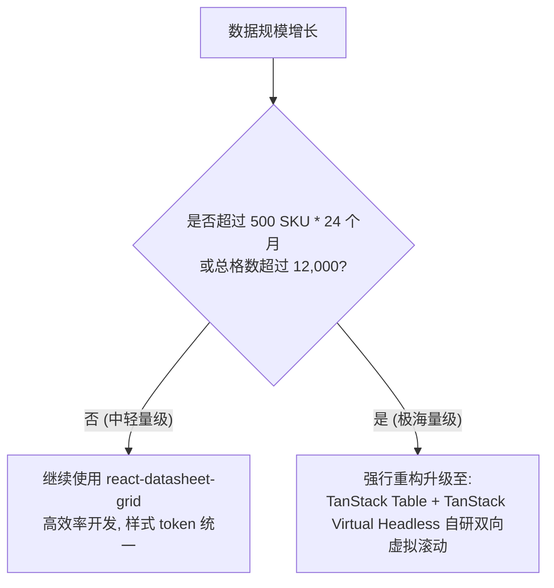

# Forecasts Spreadsheet Lab (v1.26.0) 性能与数据量验收规范

随着销售预测 SKU 数据规模以及年份跨度的增加，二维电子表格极易遭遇 DOM 节点爆炸造成的按键延迟与大块粘贴白屏崩溃。为了保障极客级的前端交互性能，特制定本性能验收与技术升级指标。

---

## 📈 性能服务等级协定 (SLA Performance Targets)

开发团队 (CC) 交付的 Forecasts 实验大表在不同 SKU 规模下，必须达到以下硬性时间阈值（在标准千元办公本或 Chrome DevTools 中进行 CPU 4 倍降速模拟验证）：

### 1. 数据量级测试场景定义
- **场景 A（基准中型场景）**：`100 SKU * 24 个月`（2 年 Forecast，共计 2,400 单元格）。
- **场景 B（高压大型场景）**：`500 SKU * 24 个月`（2 年 Forecast，共计 12,000 单元格）。

### 2. SLA 核心性能响应目标表

| 性能指标维度 | 场景 A (100 SKU * 24m) 验收目标 | 场景 B (500 SKU * 24m) 验收目标 | 性能捕获技术细节建议 |
| :--- | :--- | :--- | :--- |
| **首屏渲染加载 (First Paint)** | **≤ 1.0 秒 (s)** | **≤ 2.5 秒 (s)** | 首次进入或年份切换时，SKU 列表与网格完全呈现出数据的渲染时长。 |
| **单元格失焦修改延迟 (Cell Edit Delay)** | **≤ 60 毫秒 (ms)** | **≤ 100 毫秒 (ms)** | 任意单元格双击输入数字，按下 Enter 或 Tab 失焦后，DOM 边框更新及保存按钮激活的帧率，严禁粘滞。 |
| **大块粘贴延迟 (Paste 1,000 Cells)** | **≤ 0.8 秒 (s)** | **≤ 1.5 秒 (s)** | 一次性框选 1,000 个单元格执行 `Ctrl + V` 到表格中，从粘贴触发到所有数字完全展示于 UI 的时间。 |

---

## 💰 Firestore 批量写入打包与计费成本防线

为了防止高频密集录入行为导致企业 Firestore 写入资费暴增，CC 必须在后端逻辑设计上遵守以下“批量写入限流”防守线：

### 1. 【严禁】单元格即时写入 (Auto-save/Debounce Save Prohibition)
- 严禁在 react-datasheet-grid 中针对单元格配置 `onBlur` 触发 Firebase Save，即使做 `debounce` 也是不被允许的。
- 假如 10 名协同人员每人进行 200 格的数据平刷修改，一旦使用自动保存，短时间内就会产生 `10 * 200 = 2,000` 次的 Firestore `set` 物理写入计费。

### 2. 【必须】内存物理 Patch 缓存与一键批量保存 (Firestore Batch Save)
- 用户的编辑必须全部缓存在 React 内部状态机（如 `draftForecasts`）。
- 点击 [保存 (Save)] 时，应在前端自动对脏数据进行“**极简化 Patch 对比**”：
  - 仅打包发生了实际数值变更的 SKU 记录。
  - 使用 Firestore `writeBatch()` 对变更的 SKU 记录进行一键打包提交（单次 Batch 写入最多合并 500 个文档写入），确保一次 Save 动作为 1 次打包 IO，使 Firestore 资费相比自动保存直接下降 **95% 以上**。

---

## 🚫 表格技术架构升级分界红线 (react-datasheet-grid -> TanStack Virtual)

由于 `react-datasheet-grid` 并不具备原生的行/列双向 DOM 虚拟滚动（Virtualization）支持，当表格数据量突破一定临界值时，DOM 节点数将呈现 `Rows * Columns` 几何级数暴增，导致 React Diff 机制彻底瘫痪引发白屏。

我们特设定以下**表格技术选型升级红线**。一旦项目规模增长到相应阶段，必须执行底层引擎的彻底重构升级：

### 1. 触发重构的核心数据指标阈值
- **SKU 数量**：当工作空间内物理 SKU 数超过 **500 个**。
- **年份/月份跨度**：当财务做长周期多维度预测（例如 `5 年 * 12 个月 = 60 列`）。
- **总单元格数**：总网格单元数突破 **12,000 个** 时。

### 2. 升级重构技术栈指令 (To TanStack)
- 届时开发团队必须强行放弃 react-datasheet-grid，全面采用 **TanStack Table + Headless + TanStack Virtual**。
- 利用虚拟滚动，在内存中维护全量 Forecast 矩阵，只将视口（Viewport）内可见的 `20 行 * 12 列` 节点物理渲染为 HTML DOM，使首屏加载及任意大小粘贴在万级数据量下依然稳稳锁死在 **100ms** 之内，为产品长久可用保驾护航。
