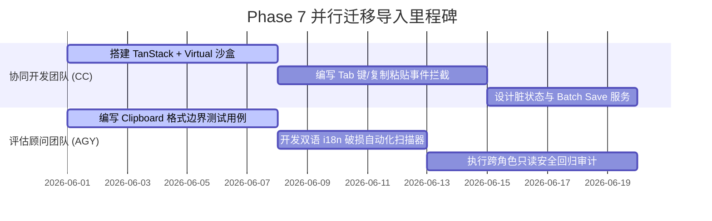

# Phase 7 Excel-like 输入渐进式迁移与分工计划

本计划定义了 **ABF Capacity Calculator** 引入 **Phase 7 高频类 Excel 输入工作流** 的**渐进式导入、防数据损坏备份与团队并列分工策略**。为了保障生产系统的极高健壮性，本计划坚决反对任何形式的大型“一次性推翻重写”，而是采用灰度发布和局部替换的安全架构路径。

---

## 一、 渐进式导入策略 (Dual-Track Progression)

为了在不破坏现有 `Products.tsx`、`Forecasts.tsx`、`CapacityPlan.tsx` 页面常态业务的前提下引入新输入架构，我们设计了**双轨并行（Dual-Track）的灰度发布机制**：

### 1. 灰度双轨制 (先实验页，再正式页)
- **第一阶段：以 Spreadsheet Lab (实验页) 为沙箱**：
  - 绝不改动正式业务页面，各业务线入口依然默认打开原生的 AppTable 或表单。
  - 在侧边栏或页面次级 Tab 引入 `ForecastsSpreadsheetLab.tsx`（预测实验表格页）。
  - 在该沙箱沙盒中引入 `TanStack Table + Virtual` 进行小范围灰度用户试用，验证复制粘贴和 Fill Right 平刷算法的兼容性与流畅度。
- **第二阶段：局部平滑替换**：
  - 当实验页面在 CI 自动测试与排产人员实际试用并获得了 100% Pass 评价后，方可切断老业务页面的编辑模式。
  - 将正式业务页面的“编辑模式”完全平滑替换为新架构的 TanStack 电子表格，而“只读看板模式”依然沿用原生的 AntD Table 以保障极致渲染速度，达成高内聚低耦合。

### 2. 哪一页先做？
- **排序决策**：**`ForecastsSpreadsheetLab` (销售预测实验页) 第一先做**！
  - *原因*：销售预测的横向月份平刷录入（12个月/24个月度格子）是目前用户最核心的痛点，其数据规律性强，结构规整，相比 Products 的多属性选择器，最易于在 Headless Table 中率先达成闭环，能以最快速度为业务产生高价值。

---

## 二、 避免数据损坏与安全回滚机制

大型表格高频录入和批量 `Ctrl + V` 最容易引入的数据灾难是**格式解析崩溃导致数据库数据污染**。我们设计了以下三层防火墙防范此风险：

### 1. 三层格式与数值防火墙 (Data Hardening)
- **第一层：本地剪贴板解析隔离**：
  - 粘贴的数据块在本地做 `try-catch` 解析。如果是带非法字符（非纯数字）的格子，系统抛出轻量级 Toast，直接拒绝注入该格，且将改动完全隔离在内存 state 中。
- **第二层：批量 Firestore Batch 物理约束**：
  - 在点击 Save 时，必须在 `batchSaveForecasts` 前调用全局的 `validateSKU` 或 `validateForecast` 方法，对生成的 payload 进行 100% 格式约束验证。若出现任意一处破损，立即物理中断 write commit。
- **第三层：Firestore Security Rules 白名单锁定**：
  - 维持 v1.22.2 的 Collect 白名单，严格限制只读和写权限，任何绕过前端发送的恶意篡改数据在云端物理 deny。

### 2. 安全回滚方案 (Rollback Strategy)
- **老数据全量快照底档备份**：
  - 在用户点击 Save 准备将电子表格的脏改动推向 Firestore 之前，系统在后台自动把拉取到的当前已保存老版本数据在本地内存中进行一份深拷贝（Old Snapshot Backup）。
  - 如果在 Batch Save 物理推送数据库的过程中，因网络延迟或云端拦截触发了 `FirebaseError`，前端自动接管异常，并**一键将备份的老数据回写进 React rows state，恢复比对大盘的初始宁静**，彻底防范“保存保存到一半发生半截数据污染”的行业黑洞。

---

## 三、 CC 与 AGY 团队并列协同分工矩阵

为了以最高的并行效率推进 Phase 7 的落地，协同开发团队 (CC) 与评估顾问团队 (AGY) 设立了清晰的并列协同边界：

### 1. 协同开发团队 (CC) 任务 (正式研发主体)
1. 升级 `package.json` 中的依赖，下载 `TanStack Table` 和 `TanStack Virtual`，做好 React 19 适配验证。
2. 建立 `ForecastsSpreadsheetLab.tsx`，搭建 Headless 虚拟滚动双轨表格。
3. 编写 Clipboard 粘贴监听，拦截 `paste` 并按 `\t` / `\n` 进行安全单元格拆解与注入。
4. 编写轻量填充柄事件组件，向右平刷填充 rows 状态。
5. 设计 Dirty State 橙色状态徽章，提供「Save」和「Discard」交互。
6. 调用 `batchSave`，一键实现 Firestore 云端事务更新。

### 2. 评估顾问团队 (AGY) 任务 (旁路评测与安全加固)
1. 编写剪贴板异常字符、超大型文本块、越界空文本的**极限测试用例集 (Edge Benchmark Cases)**，并在实验页进行模拟对账。
2. 开发 i18n paracitity 自动化扫描工具，确保 CC 编写新表格时 0 硬编码文案遗漏。
3. 执行多角色 (Owner/Editor/Viewer) 越权写和删除回归冒烟测试，核算在电子表格沙箱中 Viewer 依然被硬性拦截在只读隔离之外。
4. 针对 `batchSave` 引起的 Firestore 读写频率变化进行只读性成本评算，防范潜在的资费暴增。
