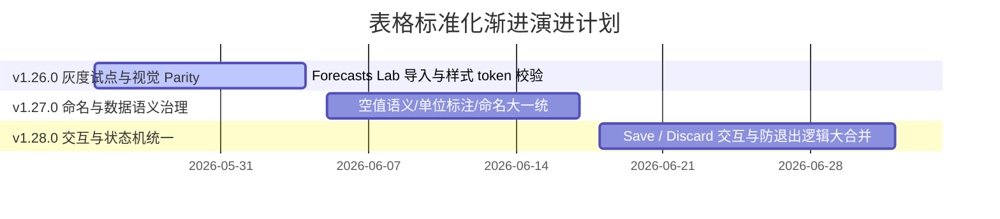

# 全产品 UI 表格标准化演进 Roadmap (v1.26.0 - v1.28.0)

为了治理 ABF 产能计算器中多表格引擎共存（Ant Design Table 与 react-datasheet-grid）引发的视觉斑驳、录入状态割裂及字段混乱问题，特制定本演进 Roadmap。

本着“**灰度并行、低侵入性、KISS 极简**”的工程精神，本路线图坚决摒弃“一次大改全站所有表”的高危方式，规划在未来 3 个版本中逐步渐进式推进。

---

## 📅 表格标准化演进阶段规划

---

## 1. v1.26.0 阶段：Forecasts Lab 导入与样式 Token 视觉 Parity
* **核心使命**：以 `ForecastsSpreadsheetLab` 销售大表为灰度试点，打通 Excel 矩阵复制粘贴的同时，完成对 `react-datasheet-grid` 样式底层重置，使其完美贴合 Ant Design 的表头、高亮、悬浮视觉风格，实现视觉 Parity。
* **物理 Scope**：
  - 在 `/forecasts-lab` 导入组件并对 grid 样式引入项目统一 CSS Class 变量修饰。
* **禁止事项**：
  - 严禁修改现存正式 Forecasts 和 Capacity 的老页面表格，保障生产环境稳定。
* **验收标准**：
  - 表头背景、文字粗细与项目主 AntD Table 100% 视觉对齐。
  - 单元格聚焦高亮边框色采用项目主蓝色（`#1677ff`），无原生刺眼粗黑边框。
* **给 CC 的建议 Task**：
  - `[ ]` Task 26.1：在 `index.css` 或全局样式表中建立 `abf-datasheet-grid-reset` 类，覆盖 react-datasheet-grid 表头与聚焦行类。
  - `[ ]` Task 26.2：在 `/forecasts-lab` 中使用全局 CSS 重置，跑通 Excel 批量多维粘贴逻辑。

---

## 2. v1.27.0 阶段：命名、空值与单位全局规范统一
* **核心使命**：对系统中所有涉及表格数据层的**“字段命名、空值逻辑、单位提示”**进行严密治理，彻底消除中英硬编码与数据语义混乱。
* **物理 Scope**：
  - 检索全产品表格的 `Columns` 配置，进行字段 Parity 治理。
* **核心治理点**：
  - **字段命名**：全产品表格的表头文案必须统一从 i18n 语言包（en.ts / zhTW.ts）中拉取，严禁直接在 columns 配置中写死中英文。
  - **空值（null）语义统一**：表格内凡遇到无数据或未设定的值，一律优雅呈现为 `—`，严禁直接显示空字符串 `""` 或随意的 `NaN`、`0`。
  - **单位统一标示**：表格表头或副标题中必须带括号明确单位（如：`目標營收 (百萬台幣)`、`銷售預測 (件)`、`產能利用率 (%)`），防止多币种或跨部门对账混淆。
* **禁止事项**：
  - 严禁擅自修改 calculationEngine 中的算式逻辑，只更改 UI 表头配置。
* **验收标准**：
  - 在 Results、Parameters、BP 等任意表格中，全站无一处 hardcode 表头，无一处 NaN/null 裸露，单位清晰。
* **给 CC 的建议 Task**：
  - `[ ]` Task 27.1：盘点并提取 Results 和 Dashboard 下所有 AntD Table 的表头文本到 `en.ts` / `zhTW.ts` 中。
  - `[ ]` Task 27.2：重构单元格 Render 逻辑，增加优雅的 `null` 占位符 `—` 渲染函数。

---

## 3. v1.28.0 阶段：状态机与 Dirty 交互逻辑大一统
* **核心使命**：收拢全站所有具备录入编辑功能的页面（Products、Capacity Lab、BP Targets、Forecasts Lab），将它们原本各自为战的状态保存、脏提示、放弃修改逻辑进行底层状态机级的大一统，并完善安全路由守卫。
* **物理 Scope**：
  - 提取公共组件 `DirtyStateActionBar` 和通用的 `useDirtyState` 自定义 Hook。
* **核心治理点**：
  - **状态ActionBar统一**：凡是有修改的编辑页面，保存与丢弃动作条的底色、高亮、间距及 [Save]、[Discard] 的 i18n 全部共享同一组件。
  - **路由守卫大一统**：只要全局有任何一个 Lab 页面处于 Dirty 脏状态，用户切换菜单时自动触发统一的防强退拦截 Modal（优雅自定义对话框，替换浏览器生硬的 prompt），提示：“您有未保存的销售/产能设定，确定要放弃吗？”。
* **禁止事项**：
  - 严禁在尚未理顺状态回滚逻辑前强行合并动作条，防止用户点击 Discard 后页面数据不重置。
* **验收标准**：
  - 4 个录入页的保存丢弃在视觉与交互上 100% Parity，无割裂感。
* **给 CC 的建议 Task**：
  - `[ ]` Task 28.1：在 `frontend/src/components` 下开发 `DirtyStateActionBar.tsx` 公共提示组件。
  - `[ ]` Task 28.2：封装 `useDirtyState` Hook，完成对 Products Lab 与 BP Targets 两个独立页面的无缝换装与联体验收。
