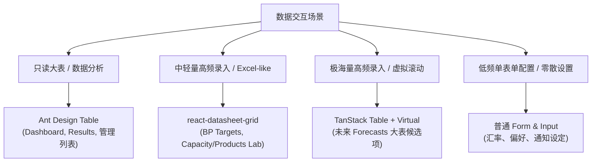

# 表格 UI 技术边界规范 (Table UI Tech Boundary Review)

为了防止前端开发中出现“表格技术选型混乱、分析与输入场景倒挂、视觉风格割裂”等现象，特制定本规范。开发团队 (CC) 在进行表格开发或重构时，应严格遵循本规范定义的边界。

---

## 🧭 四大表格/输入技术边界划分

在 ABF 产能计算器中，数据表格与录入组件根据“交互频次”、“数据量级”以及“读写形态”分为以下四个层级：

### 1. Ant Design Table (精美分析与只读管理)
- **定位**：开箱即用，视觉优雅，适合**“高频查看、极低频操作、结构化清晰”**的报表。
- **适用场景**：
  - 数据分析页：Results 目录下的 `BP Analysis`、`Capacity Results`。
  - 仪表盘与大屏：Dashboard 各类分组对比汇总表格。
  - 基础管理列表：快照历史列表（Snapshot List）、项目切换列表、团队成员权限列表。
- **优缺点分析**：
  - *优点*：Ant Design 自带精美样式，排序、筛选、分页开箱即用，与全局 AntD 风格 100% 融合。
  - *缺点*：不支持大批量单元格键盘导航与拖拽平刷，不适合作为高频密集录入工具。

### 2. react-datasheet-grid (中轻量高频录入 / Excel-like)
- **定位**：兼顾开发效率与 Excel 键盘贴附感，适合**“年份/产品横向排列、需要大块粘贴”**的表格输入。
- **适用场景**：
  - 独立 BP Targets 录入页（本轮 v1.25.0 核心改动）。
  - `ProductsSpreadsheetLab` / `CapacitySpreadsheetLab` 等中等数据规模的实验性录入表。
- **优缺点分析**：
  - *优点*：支持标准的横向/纵向批量复制粘贴，支持 Tab/Enter 键盘导航，开发成本较低，完美契合财务小表录入。
  - *缺点*：在大数据量（>500 行 * 24 列）下缺乏原生虚拟滚动支持，容易出现渲染卡顿；自定义下拉框与日期选择组件视觉定制难度较高。

### 3. TanStack Table + Virtual (极海量高性能 Headless 输入)
- **定位**：性能怪兽，彻底掌握 DOM 渲染控制权，适合**“千级行、万级单元格、复杂自定义逻辑”**的高频录入。
- **适用场景**：
  - 未来 Forecasts 模块在 Excel-like 虚拟滚动改造时的唯一首选候选方案。
  - *注意：本轮 v1.25.0 不强求实现，作为中长期技术储备。*
- **优缺点分析**：
  - *优点*：Headless 机制不带任何多余样式，允许我们以 Ant Design 规范 100% 深度重绘；原生支持行/列双向虚拟滚动（Virtualization），万级单元格录入依然 0 延迟。
  - *缺点*：没有开箱即用的 UI，键盘导航、框选、平刷填充柄等高级 Spreadsheet 交互全部需要手动通过事件监听器实现，研发工期较长。

### 4. 普通 Form / Input 组件 (低频散装设置)
- **定位**：Ant Design 标准表单，用于**“零散、非表格态、单值修改”**。
- **适用场景**：
  - `Parameters` 页面中的汇率参数设置（如 USD to TWD, CNY to TWD）。
  - 用户个人偏好、通知设置、系统级开关等。
- **优缺点分析**：
  - *优点*：简单直接，表单校验生态极其完备。
  - *缺点*：如果数据呈二维矩阵分布，使用散装 Input 会导致页面 DOM 节点暴增，体验极其割裂。

---

## 🎨 视觉一致性要求 (Visual Parity Lines)

为避免混合使用 Ant Design Table 与 react-datasheet-grid 时产生视觉上的斑驳感，必须对 `react-datasheet-grid` 实施样式重写，遵循以下一致性规范：

1. **表头视觉对齐**：
   - 颜色：表头背景色必须统一使用 Ant Design Table 的默认浅灰色（如 `#fafafa` 或 HSL 调和色）。
   - 字体：表头文字应使用 `rgba(0, 0, 0, 0.88)`，加粗，字体大小统一为 `14px`。
2. **边框与悬浮**：
   - 表格边框颜色统一使用极浅的灰色（如 `#f0f0f0`），杜绝原生 react-datasheet-grid 过于刺眼的深黑边框。
   - 悬浮行（Hover Row）必须有极淡的背景过渡（如 `#fafafa`），给予用户明确的行聚焦视觉暗示。
3. **单元格激活与选中**：
   - 单元格在选中（Focus）或多选框选（Selection Area）时，其外边框应使用 Ant Design 主色（如 `#1677ff`），禁止使用其他色系的亮绿色或深蓝色。

---

## 🚫 研发红线与禁止事项

为了保证软件架构的纯洁与高可用性，向 CC 团队发布以下硬性红线：

> [!WARNING]
> **红线 1：禁止由于偏执的“技术栈大一统”而将所有数据分析表格 Spreadsheet 化！**
> 数据分析（Results）以“高可读性、直观对比、图表联动”为核心价值，强行使用 spreadsheet 会导致排序、分类汇总、条件格式极难开发，且大大降低信息传达效率。

> [!WARNING]
> **红线 2：禁止在 react-datasheet-grid 中直接引入未经过滤的物理 DOM 乱入！**
> 任何自定义渲染器（Renderer）必须做充分的性能防抖与生命周期销毁，避免导致高频输入时的内存泄漏与按键响应粘滞。

> [!WARNING]
> **红线 3：禁止在表格只读状态（Workspace Viewer）下暴露任何可编辑的单元格边框或保存按钮！**
> Viewer 态必须将整个 Table 组件置为只读模式，不可让用户双击产生编辑光标。
