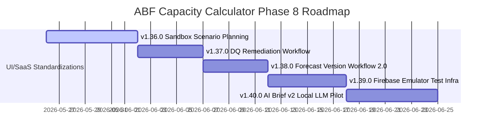

# v1.35.0 之后产品路线图重置 (Roadmap Reset)

随着产品定位正式升级为 **“协同决策分析工具 (Collaborative Decision Analysis Tool)”**，后续迭代（Phase 8，即 `v1.36.0` 到 `v1.40.0`）的核心路线应该围绕：
1. **深化 What-If 多场景仿真决策能力**。
2. **闭环数据质量缺陷的自愈流（Remediation Workflow）**。
3. **强化多人协同下的版本控制与安全防线测试**。

以下是重置后的 Phase 8 产品路线图建议顺序：

---

## 一、 Phase 8 产品路线图规划 (v1.36.0 – v1.40.0)

### 1. v1.36.0: Sandbox Scenario Planning (多场景沙盒仿真模拟) ★★★ (最高优先级)
- **核心功能**：
  - 用户可以一键“创建沙盒情境 (Create Sandbox Scenario)”。
  - 系统在内存中完全复制（或克隆子存储）一份当前的正式产品、预测和产能数据。
  - 用户可在沙盒中自由篡改产品单价、单月预测、工厂产能配置，任意跑 `runCalculation`。
  - 沙盒数据与正式工作区数据完全物理隔离，Viewer 角色在沙盒中拥有只读仿真权。
  - 提供“沙盒 vs 生产版本”的 Change Review 变更对比卡片，评估“若某大客砍单 10% 且单价跌 5%，则 BP 达成率的变化”。
- **商业价值**：直接引爆产品的 What-If 决策模拟能力，产品从“录入器”质变为“产业策略沙盘”。

### 2. v1.37.0: Data Quality Remediation Workflow (数据质量即时自愈引导流)
- **核心功能**：
  - 在 `v1.35.0` DQ Visibility 前移的基础上，实现警示的**一键闭环自愈**。
  - 用户点击 Table 单元格或 Alert 中的 DQ 警告图标，弹出快捷修复引导。
  - 例如：点击“SKU 缺失层数”的红色 Badge，直接在行右侧拉出该 SKU 的“极简属性补全抽屉 (Drawer)”，输入层数保存后，全表 DQ 状态瞬间刷新，省去跳转和查找成本。

### 3. v1.38.0: Forecast Version Workflow 2.0 (多人协同版本锁与审批流)
- **核心功能**：
  - 深度结合共享工作区角色。
  - 限制 Editor 只能创建或提交 `Draft` / `Reviewed` 状态的预设版本。
  - 唯有 `Owner` 角色拥有“锁定版本 (Lock Version)”与“归档版本 (Archive Version)”的最终审批权限。
  - 被锁定后的版本，在所有页面（即便 Editor 登录）中也均自动降级为 true read-only 状态，不可再做任何微小保存或篡改，防止月度财务规划基线发生意外偏移。

### 4. v1.39.0: Firebase Emulator Security Test Infrastructure (安全规则模拟器回归测试基建)
- **核心功能**：
  - 在本地搭建基于 `firebase emulators` 的自动化 CI 测试流水线。
  - 编写全面的 security rules 测试套件，重点覆盖：多人协作防越权、快照 Immutable 属性防修改、不同角色在沙盒及主干数据的写入限制等。
- **技术价值**：将 SaaS 的安全级别提升至工业级防线，确保规则修改不会引发权限雪崩。

### 5. v1.40.0: AI Brief v2 (本机 AI 简报与高级归因归档)
- **核心功能**：
  - 在用户完成 Scenario 对比或 Change Review 后，探索在前端采用 WebLLM 技术进行零网络调用的“本本当地 LLM 摘要”试点，规避敏感商业数据流向外网的隐私风险。
  - 拓展更精准的 Attribution attribution 模板。
