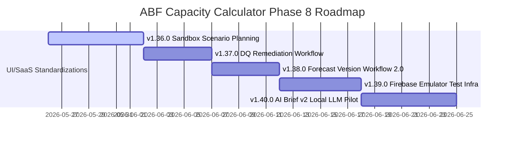

# v1.35.0 之后产品路线图重置 (Roadmap Reset)

随着产品定位正式升级为 **“协同决策分析工具 (Collaborative Decision Analysis Tool)”**，后续迭代（Phase 8，即 `v1.36.0` 到 `v1.40.0`）的核心路线应该围绕：
1. **深化 What-If 多场景仿真决策能力（核心价值点）**。
2. **闭环数据质量缺陷的自愈流 (Remediation Workflow)（效率体验点）**。
3. **强化多人协同下的版本安全与自动化测试防线（企业工程底座）**。

以下是重置后的 Phase 8 产品路线图建议顺序：

---

## 一、 Phase 8 产品路线图甘特图 (Roadmap Gantt)

---

## 二、 建议版本顺序深度解析 (v1.36.0 – v1.40.0)

### 1. v1.36.0: Sandbox Scenario Planning (多场景沙盒仿真模拟) ★★★ (最高优先级)

* **演进逻辑**：直接攻克系统的“一号致命缺口”。将原本静态、只读的 Working 分支，升级为支持 What-If 的“动态产业策略沙盘”。
* **核心功能**：
  - **沙盒控制抽屉 (Sandbox Drawer)**：顶栏一键切换“生产环境 (Production)”与“沙盒工作区 (Sandbox)”。
  - **内存级沙盒状态**：在切换到沙盒时，系统在前端内存中完全克隆（`lodash.cloneDeep`）当前的 Products, Forecasts, Capacity 数据。
  - **拦截物理写入**：在沙盒模式下，用户可以任意修改 SKU 单价、良率或单月预测片数，运行 `runCalculation`，但这些临时篡改不会被写入 Firestore 数据库，彻底保障正式工作区安全。
  - **沙盒 vs 生产对比卡片**：提取沙盒与生产的差异，利用现有的 `changeImpact` 引擎，瞬时渲染出“降价与砍单对全年营业目标（BP）达成率的影响”归因分析卡片。
* **商业与用户价值**：爆破 What-If 决策价值，使产品从“数据录入器”质变为“产业决策策略沙盘”。

### 2. v1.37.0: Data Quality Remediation Workflow (数据质量即时自愈引导流) ★★

* **演进逻辑**：在 v1.36.0 沙盒仿真落地后，频繁的数据篡改对数据质量（DQ）提出了更高频的要求。本版本将 v1.35.0 的 DQ Visibility “可视化警告”闭环为“即时自愈”。
* **核心功能**：
  - **就地点击激活 (Click to Fix)**：对表格中的 DQ 红色 Badge 绑定 onClick 快捷操作，点击警告直接阻止冒泡并拉出该行数据的“属性极简自愈抽屉 (Quick Fix Drawer)”。
  - **快捷补全抽屉**：抽屉高亮缺失的字段（如缺失良率或计价币别输入红框），用户就地补全并点击“自愈”，数据就地保存更新，页面自动刷新 DQ 状态，免除传统的大跳转与手动检索定位。
* **商业与用户价值**：极速提升数据录入的流畅度，保证沙盒和主干数据的“高可信度”。

### 3. v1.38.0: Forecast Version Workflow 2.0 (多人版本协同与安全审批流) ★

* **演进逻辑**：有了沙盒和自愈后，数据输入变得灵活而高频。在多人协作环境下，为防止多个 Editor 误删或误篡改“年度预算基线（BP Baseline）”，版本锁定和审批流迫在眉睫。
* **核心功能**：
  - **快照版本冻结 (Version Freeze)**：只有 `Owner` 角色能够将快照版本标记为 `Locked` (已锁定) 或 `Archived` (已归档)。
  - **制约逻辑**：被锁定或归档的版本，限制任何人（包括 Owner 自身）删除或覆盖 Working 数据，直至手动解除锁定。
  - **协同操作日志 (Audit Log MVP)**：记录快照的创建人、锁定人以及锁定时间，并在 UI 显著标识。
* **商业与用户价值**：筑起多人协同下的“防篡改防线”，使系统具备真正的工业级合规保障。

### 4. v1.39.0: Firebase Emulator Security Test Infrastructure (安全规则自动化回归测试基建)

* **演进逻辑**：在多场景沙盒仿真、多人协同只读拦截、快照锁定等逻辑上线后，`firestore.rules` 文件的安全权限逻辑变得极度复杂。人工测试安全规则已无法跟上开发进度，需要建立自动化防护网以解决累积的技术债。
* **核心功能**：
  - **本地 Firebase 模拟器集成**：搭建本地 `firebase emulators:start` 流程。
  - **回归安全测试套件**：使用 `@firebase/rules-unit-testing` 编写全面的安全规则测试，测试场景覆盖：Viewer 试图写入 Sandbox 外部资源、Editor 试图删除 Owner 锁定的 Snapshot、跨 Workspaces 的数据越权读写等。
* **技术价值**：将 SaaS 的安全级别提升至工业级防线，确保规则修改不会引发权限雪崩或越权漏洞。

### 5. v1.40.0: AI Brief v2 (本站本机大模型摘要探索)

* **演进逻辑**：在系统的物理规则、沙盒模拟、协同版本锁、数据质量自愈、安全测试基座全面封顶之后，最后引入前端 WebLLM 技术进行零网络调用的高级归因，完成闭环。
* **核心功能**：
  - **零网络 AI 简报**：在前端集成极轻量大模型（如 WebLLM 驱动的 Qwen/Gemma-2b），在用户完成 Scenario 对比后，于浏览器沙盒内直接读取脱敏 JSON payload 生成深度总结。
  - **商业隐私红线规避**：100% 数据留在用户本地，不涉及任何外部 API 调用和数据传输，彻底打消企业法务的机密泄露顾虑。
* **商业与用户价值**：提供智能的、“开箱即用”且绝对安全的 AI 决策助手，体验优雅闭环。
