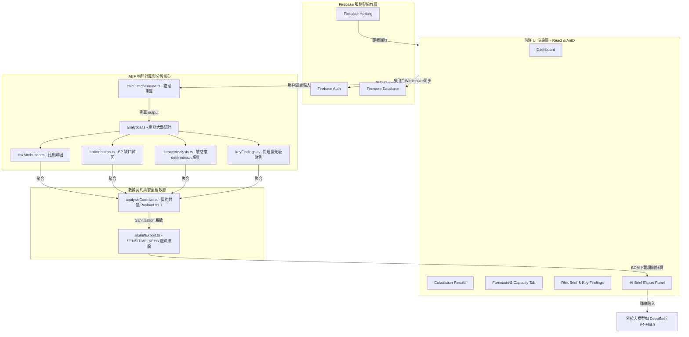

# ABF Capacity Calculator 專案架構與長期發展 Roadmap 白皮書

---

## 1. 一句話總結 (Executive Summary)
**ABF Capacity Calculator** 是一款專為 ABF（Ajinomoto Build-up Film）載板產業打造的多用戶協作產能規劃與決策分析工具。它支援多幣別（USD/TWD/CNY）與百萬 TWD 業務指標（BP Targets）的精準折算，提供決策級產能瓶頸、加權風險歸因與 determinstic 價格/產能敏感度場景分析，並可一鍵安全導出脫敏的 AI 分析包，用於外部大語言模型（如 DeepSeek V4-Flash）的離線決策輔助。

---

## 2. 產品目標與長期願景 (Product Goals & Long-Term Vision)

### 2.1 我們最初要解決什麼問題？
- **載板產能結構性矛盾**：ABF 載板生產步驟極其複雜（如 Core 與 BU 層別產能難以拉平），傳統上依靠低效、易出錯且無法協作的巨大 Excel 表進行產能核算。
- **BP 與業績差距割裂**：業務與設備規劃割裂，當客戶預測發生高頻微調或多幣別變動時，規劃人員難以第一時間計算出業績指標（BP Targets）達成率（Attainment）的波動。
- **算術幻覺與安全隱憂**：大模型（AI）直接接觸原始財務隱私會引發洩漏風險，且 AI 的算術幻覺極易篡改載板核心物理公式，誤導重大擴產決策。

### 2.2 現在產品要服務什麼工作流？
系統已打通了 **「輸入數據配置 $\rightarrow$ 決定性物理重算 $\rightarrow$ 決策級 Risk Brief 診斷 $\rightarrow$ 離線安全 Brief Pack 拷貝 $\rightarrow$ 外部 AI 對抗解讀與打分」** 的全套產能分析與品質閉環工作流，全方位服務於銷售（Sales）、產品規劃（Product Planning）、產能規劃（Capacity Planning）及公司高管（Executive）的協作決策。

### 2.3 長期願景 (Long-Term Vision)
建立一套**高決定性、零 API 隱私風險、以 AI 輔助為核心的 ABF 產能決策沙盤**。在未來，系統能在每次 Forecast 改動後自動保存版本快照（Snapshot），通過 deterministic scenario（決定性場景模擬）算出 Delta 變更指標，再由離線 AI 提供基於 F-A-I-R 分類與歸因免責的客觀對策，最終實施有「人類在環」（Human-in-the-loop）防護的安全決策。

---

## 3. 目前功能模組完成度大盤 (Delivered Features)

截至 `v1.21.1`，系統的功能模組已達到高度完備狀態：

### 📁 核心功能模組一覽：
1. **Core Data (數據底座)**：
   - 支持產品與 SKU 維度配置（晶片尺寸、layerCount 層數、單價等）。
   - 預測（Forecasts）與月度/日產能計劃（Capacity Plans）表格化管理。
   - 百萬 TWD 業績目標（BP Targets）以及系統全局匯率參數。
2. **Collaboration (協作層)**：
   - 整合 Firebase Auth 帳戶管理與 Firebase Hosting 部署。
   - 支援個人（Personal Workspace）與多人共享（Shared Workspace）切換。
   - 劃分了 Owner (最高權限/全局管理)、Editor (可讀寫)、Viewer (唯讀) 角色。
3. **Currency / BP (多幣別與 BP 防火牆)**：
   - 支援輸入單價為 USD / TWD / CNY，系統自動將預測營收歸一化折算為 USD。
   - BP Target 鎖定為「百萬 TWD」，大盤對比時使用參數定義的匯率進行高精折算，安全阻絕算術盲區。
4. **Analysis (決策級分析模組)**：
   - **Dashboard**：直觀大盤趨勢。
   - **Results & Risk Brief**：決定性分析，無 AI，包含 Data Quality (數據品質 Caveats 評估及決策影響評估)。
   - **Risk Attribution & BP Attribution**：比例歸因分析（按客戶/SKU/尺寸等維度分攤 Gap 份額）。
   - **Deterministic Scenarios**： deterministic ±10% 價格變動敏感度與 Core/BU +10% 產能改善情境。
   - **Key Findings**： deterministic top-5 跨模組優先級問題清單。
5. **AI Export & Eval Kit (AI 離線導出與評測)**：
   - 一鍵導出 `Combined AI Brief Pack` (Prompt + Sanitized JSON)。
   - 下載 JSON 注入 UTF-8 BOM `\ufeff` (防止 Excel 打開亂碼)，並調用 `revokeDownloadUrl` 釋放 Object URL。
   - 中文 Prompt 內建 F-A-I-R 分類、Weighted Pressure 警告及 Blocked 數據降級護欄。
   - 交付了完整 AI Eval Kit（包含 Benchmark cases, Scorecards, Rubric 以及 DeepSeek 專用離線 Prompt 與評分卡）。

---

## 4. 現在的技術架構 (Project Architecture)

專案採用 **Frontend-Only + Serverless Backend (Firebase)** 的輕量化、高響應式架構。計算模組與 UI 渲染物理隔離，保證了數據的高度安全與公式的決定性。

### 📡 系統技術架構拓撲圖 (Mermaid Topology)：



### 📋 架構核心設計要點：
1. **決定性計算引擎 (`calculationEngine.ts`)**：輸入一旦確定，計算結果 100% 唯一，無任何折返重估，禁止 AI 介入運算。
2. **Analysis Contract 數據契約**：大盤計算完畢後，所有分析結果聚合為一個 v1.1 Payload。在導出給 AI 前，遞歸擦除所有隱私字段（UID, email, Token, Workspace ID 等），業務標識（如 SKU-code）予以保留，防範商業隱私外洩。
3. **i18n Parity (多語言對齊)**：系統全面支持 EN 与 zh-TW 雙語切換。單元測試中內建了 key parity 檢查，確保兩種語言的 key 100% 鏡像對齊，無任何 `{placeholder}` 殘留。

---

## 5. 目前專案狀態綜合評估 (Current Status Assessment)
- **可用性 (Usability)**：**高**。系統已經線上正式發布 `v1.21.1`，多人協作、多幣別大盤、 deterministic 敏感度分析完全穩定，可直接投入真實營運規劃。
- **穩定部分 (Stable)**：計算引擎、Firebase 數據同步與權限 rules、i18n 對齊、AI Brief Sanitized 離線包導出。
- **實驗性部分 (Experimental)**：
  - **`Products Spreadsheet Lab`** (Excel-like 編輯面板) 仍屬於實驗室功能，可能有小幅交互延遲，建議後續優化。
  - **`Refine` 迭代公式**：因極易引發循環嵌套計算崩潰，已被**物理移除**，嚴禁後續開發人員盲目恢復。
- **AI API 對接狀態**：目前為 **Offline-First (離線拷貝)**。系統不調用任何外部 LLM 的實體 API，數據保持 100% 本地化，用戶需手動貼入外部模型。
- **未實作部分**：Phase 6 預測版本控制與變更影響對決 (Forecast Versioning) 模組目前僅完成了架構設計與驗收測試包，代碼尚未實作。

---

## 6. 長期發展 Roadmap 階段規劃

專案未來的開發推薦按以下 4 個大階段穩步推進，嚴防過度工程化：

```text
+-----------------------+      +-----------------------+      +-----------------------+
|  Phase 6 & 6.1 (開發) |      |  Phase 7 (場景模擬)   |      |   Phase 8 (AI整合)    |
|  - 快照存盤與雙版本比較 | --->  |  - 產能/價格沙盤模擬  | --->  |  - 離線AI評測向API探索|
|  - 權限卡死與體積控制   |      |  - 差值因果深度分析   |      |  - Human-in-the-loop  |
+-----------------------+      +-----------------------+      +-----------------------+
```

### Phase 6：Forecast Versioning & Change Impact Review (當前首要任務)
- 實作手動 Snapshot 建立、列表與 creator-only 刪除。
- 實作 Base vs Target 快照選擇器與 Change Review 面板。
- 渲染 12 大 Delta 比較指標與客戶/SKU Delta 對對碰表格。
- 導出離線 Change Impact Pack 用於 DeepSeek 盲測。

### Phase 6.1：Harden & Security Hardening (品質強化)
- 快照體積限制（Hybrid 存盤策略確保文檔小於 100KB）。
- Firestore Rules 對快照 Immutable 唯讀控制的防守測試。
- 處理極端空數據快照與單快照狀態。

### Phase 7：Scenario Planning &沙盤模擬 (深度模擬)
- 支援用戶在不改變 production 數據的前提下，建立多維虛擬 sandbox 情境。
- 支持同時模擬「Core產能+10% 且 價格-5% 且 需求增加 20%」的交叉沙盤，直觀預覽 Attainment 變動。

### Phase 8：AI-assisted Analysis & 實體 AI 探索 (AI 整合)
- 當外部大模型（如 DeepSeek V4-Flash）在我們的 AI Eval Kit 中累積通過率達到 99% 時，探索引入合規的代理伺服器（Proxy Server），實施後台實體 AI API 呼叫。
- **必須保留「人類在環」（Human-in-the-loop）機制**：AI 給出的任何優化建議（如調整某個 Forecast 數量），在未經 Owner 明確點擊確認前，**絕對不可**直接修改資料庫。

### Phase 9：Operationalization & 審計合規 (營運標準化)
- 引入完整 Audit Logs (審計日誌)，記錄誰在何時建立了快照、誰修改了核心參數。
- 優化 Products Spreadsheet 面板，支持批量 Excel 導入與導出標準化。

---

## 7. 任務批次與預估時程 (Batch & Duration Estimates)

為了讓 CC 或未來開發者能有條不紊地開發，我們將後續開發拆解為 **5 大務實批次 (Batches)**，並給出工作量估計（不承諾具體日曆日期）：

| 批次序號 | 批次名稱 | 核心工作內容 | 主要風險 | 驗收與交付標準 | 是否部署 | 預估工作量 |
| :--- | :--- | :--- | :--- | :--- | :---: | :---: |
| **Batch 1** | **Phase 6 MVP 實作** | - 建立 Firestore 快照數據讀寫接口與 immutable 權限 rules。<br>- 實作快照建立、列表與 Compare Selector 元件。 | - 快照數據過大導致 Firestore 寫入超時。 | - 成功手動建立 2 個快照，且對比選擇器正常工作。 | 否 | **中**<br>(1-3 天) |
| **Batch 2** | **Change Impact 渲染**| - 實作 12 個 Delta 對決指標計算。<br>- 渲染對決卡片與客戶/SKU Delta Table，導出 Change Pack。 | - 差值小數點精度漂移，多幣別折算混亂。 | - 12 個對決指標渲染精確，導出 JSON 無隱私洩漏。 | 否 | **中**<br>(1-3 天) |
| **Batch 3** | **Phase 6.1 品質修補**| - 實作快照 Hybrid 體積控制。<br>- 補齊快照唯讀規則與 Viewer 拒絕手動單元測試。<br>- 跑通 test/lint/build。 | - 測試掛起，ESLint irregular whitespace 報錯。 | - 300+ 測試 100% 綠過，linter 零錯誤。項目部署上線。 | **是** | **小**<br>(0.5-1 天) |
| **Batch 4** | **DeepSeek 離線評測** | - 將導出的 Change Impact Pack 貼入 DeepSeek 實測。<br>- 按照 Rubric 和 Scorecard 打分，得出首輪選型報告。 | - DeepSeek 發生因果混淆 Veto 否決。 | - 取得完整的首輪 DeepSeek 評分卡，確認 Verdict = PASS。 | 否 | **中**<br>(1-2 天) |
| **Batch 5** | **Scenario 沙盤設計** | - 起草 Phase 7 Scenario 沙盤模擬的技術設計規格書與 inputs 克隆方案。 | - 過度設計導致系統複雜度失控。 | - 獲得用戶批准的 Phase 7 實施計劃與數據模型。 | 否 | **小**<br>(1 天) |
