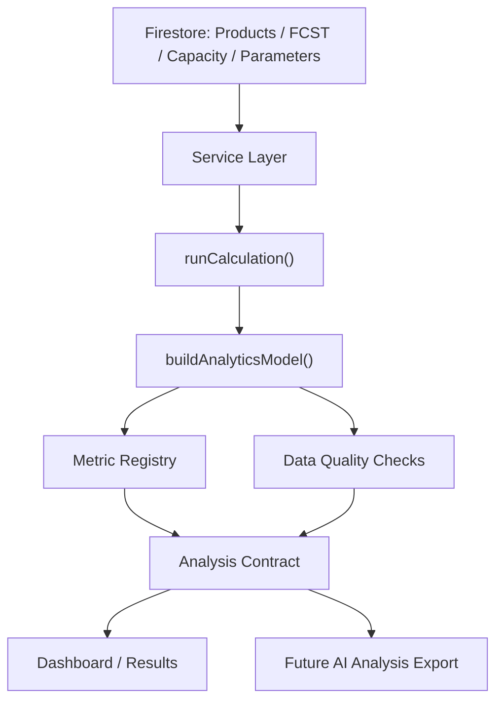

# Phase 5 Analysis Contract Foundation Design

## Purpose

ABF Capacity Calculator has working foundations for Products, FCST, Capacity, BP targets, Dashboard, and Results. The next phase should not add more surface-level tables first. It should create a rigorous analysis contract so future AI-assisted capacity and product-change analysis can read trustworthy, traceable, and consistently defined data.

The goal of Phase 5 is to turn the current analysis layer from "calculated output" into "decision-grade evidence." Every important metric should have a definition, source lineage, quality status, and machine-readable structure.

## Current State

### What Is Already Strong

- `runCalculation()` is deterministic and tested.
- `bpTargets.ts`, `forecastGrowth.ts`, `currency.ts`, and SKU derived helpers have focused tests.
- Dashboard and Results already use a shared analytics layer through `core/analytics.ts`.
- Phase 3 added product-risk tests around BP analysis, forecast yearly growth, and mock Firestore service behavior.
- Phase 4 and 4.1 improved performance without changing business logic.

### Current Gaps

1. **Metric definitions are not centralized**
   Some definitions live in README, some in `ANALYTICS_GUIDE.md`, some only in code. This makes future AI analysis risky because the AI may infer formulas from stale documentation.

2. **Documentation has at least one formula mismatch**
   `ANALYTICS_GUIDE.md` says Revenue is `forecastPcs * unitPrice * (1 - yieldLoss)`, while current code calculates `forecastPcs * unitPrice`. The product must decide and document the official formula.

3. **Analytics model is useful but not contract-based**
   `core/analytics.ts` produces Dashboard/Results structures, but it does not expose a formal metric registry, data lineage, assumptions, missing data, or confidence status.

4. **Data completeness is implicit**
   Users can see outputs, but the system does not clearly flag incomplete or suspicious input states before analysis, such as forecast without SKU, BP target without forecast, missing exchange rate, forecast year without capacity, or BU demand with zero BU capacity.

5. **AI export does not exist yet**
   Future AI analysis needs structured input like summary, metrics, risks, drivers, assumptions, missing data, and time-series matrices. Today, AI would have to scrape UI tables or read internal objects without a stable contract.

## Design Principles

1. **Do not change calculation formulas in Phase 5**
   Phase 5 documents and wraps existing formulas. Formula changes require explicit approval and dedicated tests.

2. **Analysis before AI**
   Do not add an AI chat UI or external AI API yet. First create a stable export format that AI can safely consume later.

3. **Evidence over narrative**
   Every future AI conclusion should be grounded in machine-readable metrics, lineage, assumptions, and warnings.

4. **Time remains horizontal**
   Analysis matrices keep the current standard: rows are metrics/dimensions, columns are time periods.

5. **Firebase remains unchanged**
   No backend migration, no Cloud Functions, no schema rewrite.

## Proposed Architecture

Phase 5 introduces three conceptual layers above existing calculation logic.



### 1. Metric Registry

A metric registry defines official metric meanings, formulas, units, source fields, and display behavior.

Example metric contract:

```ts
interface MetricDefinition {
  id: string;
  labelKey: string;
  descriptionKey: string;
  formula: string;
  unit: 'pcs' | 'panel' | 'percent' | 'usd' | 'millionTwd' | 'month' | 'text';
  source: Array<'products' | 'forecasts' | 'capacityPlans' | 'parameters' | 'calculation' | 'analytics'>;
  aggregation: 'sum' | 'max' | 'average' | 'ratio' | 'status' | 'derived';
  ownerView: 'sales' | 'productPlanning' | 'capacity' | 'executive';
}
```

Initial metric groups:

- Revenue and BP attainment
- Forecast PCS
- Core/BU demand
- Core/BU capacity
- Core/BU utilization
- Shortage and bottleneck
- Customer/SKU/size/application/product-grade contribution

### 2. Data Quality Checks

Create an analysis quality layer that evaluates data before or alongside analysis.

Recommended issue structure:

```ts
interface DataQualityIssue {
  id: string;
  severity: 'error' | 'warning' | 'info';
  domain: 'products' | 'forecast' | 'capacity' | 'parameters' | 'bp' | 'currency' | 'analytics';
  messageKey: string;
  affectedPeriods?: string[];
  affectedSkuIds?: string[];
  evidence?: Record<string, string | number | boolean | null>;
}
```

Initial checks:

- Forecast references missing SKU.
- SKU has invalid chip dimensions, layer count, size category, or unit price.
- Forecast exists for a year/month but no capacity exists for that same period.
- BP target exists for a year but forecast revenue is zero.
- Yearly exchange rate mode is enabled but a forecast/BP year has no rate.
- BU demand is greater than zero while BU capacity is zero.
- Capacity exists without forecast, shown as informational rather than failure.
- Analysis includes orphan or skipped data.

### 3. Analysis Contract Export

Create a stable machine-readable analysis payload. This is not an AI integration yet. It is the future input for AI.

Recommended payload:

```ts
interface AnalysisContractPayload {
  version: '1.0';
  generatedAt: string;
  projectId: string;
  timeRange: {
    months: string[];
    years: string[];
  };
  metricDefinitions: MetricDefinition[];
  quality: {
    status: 'ok' | 'warning' | 'error';
    issues: DataQualityIssue[];
  };
  summary: {
    totalRevenueUsd: number;
    totalForecastPcs: number;
    maxCoreUtilization: number | null;
    maxBuUtilization: number | null;
    shortageMonthCount: number;
    worstBottleneckMonth: string | null;
  };
  yearlyHealth: unknown[];
  bpAnalysis?: unknown;
  matrices: {
    revenueByCustomer: unknown[];
    revenueBySku: unknown[];
    revenueBySize: unknown[];
    coreDemandBySize: unknown[];
    buDemandBySize: unknown[];
    coreDemandByApplication: unknown[];
    buDemandByApplication: unknown[];
  };
  assumptions: string[];
}
```

The implementation should use concrete project types rather than `unknown`, but this design keeps the shape readable.

## Product Interpretation Model

Future AI analysis should answer three role-based questions:

### Sales View

- Which customers drive revenue and BP attainment?
- Which customers create shortage exposure?
- Which SKU/customer combinations create the largest BP gap?
- Are revenue changes driven by volume, price, or mix?

### Product Planning View

- Which size, layer bucket, application, or product grade is driving demand?
- Are product mix changes creating new Core/BU pressure?
- Which product groups are growing faster than capacity?
- Which SKUs deserve review because they contribute low revenue but high capacity consumption?

### Capacity Analysis View

- Which years/months have Core or BU risk?
- Which factory/month assumptions create the biggest gap?
- Is shortage concentrated in a few months or structurally persistent?
- What capacity expansion would relieve the most risk?

Phase 5 should not fully solve all of these. It should produce the data contract that makes these questions answerable.

## Recommended Implementation Scope

### In Scope

- Add metric definition registry.
- Add data quality checker.
- Add analysis contract builder.
- Add tests for metric definitions, quality checks, and export shape.
- Update analytics documentation to match actual formulas.
- Add a lightweight export or debug panel only if useful, but UI should be minimal.

### Out of Scope

- AI chat UI.
- External AI API calls.
- Formula changes.
- Firestore schema changes.
- Dashboard redesign.
- Full Results page rebuild.
- Large component refactors.

## Testing Strategy

Tests should cover:

- Metric registry has stable IDs and no duplicate IDs.
- Revenue formula documentation matches current code behavior.
- Forecast with missing SKU creates a quality warning/error.
- Missing capacity for forecast period creates a warning.
- Missing yearly exchange rate creates a warning when yearly mode is enabled.
- BU demand with zero BU capacity creates a high-severity issue.
- Analysis contract payload contains summary, metric definitions, quality section, assumptions, and matrices.
- Empty data produces a valid payload with quality warnings, not stale output.

## Documentation Updates

Update or create:

- `ANALYTICS_GUIDE.md`: align formulas with current code.
- `DEVELOPMENT.md`: document analysis contract flow.
- New `ANALYSIS_CONTRACT.md`: official metric definitions, data lineage, quality checks, and AI export principles.
- README version history when implementation ships.

## Risks

1. **Overbuilding AI infrastructure too early**
   Avoid AI API integration until the contract is stable.

2. **Accidentally changing formulas**
   Treat formula changes as separate decisions.

3. **Too many warnings reduce trust**
   Quality issues should be prioritized by severity and grouped by domain.

4. **Contract becomes another stale doc**
   Tests should enforce metric IDs and key formula assumptions.

## Recommended Phase 5 Deliverable

Ship v1.15.0 with:

- `core/metricDefinitions.ts`
- `core/dataQuality.ts`
- `core/analysisContract.ts`
- Tests for the above
- `ANALYSIS_CONTRACT.md`
- Updated `ANALYTICS_GUIDE.md`
- No visible major UI change except optional quality status display in Results/Dashboard if low-risk

## Approval Gate

Before implementation, review this design with:

1. gstack office-hours for product framing.
2. gstack CEO review in SELECTIVE_EXPANSION mode for second-stage planning.
3. Engineering implementation plan after scope is approved.

